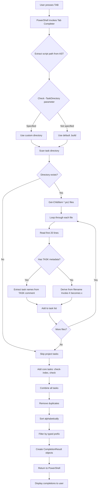

# Bolt! ⚡

[](https://github.com/motowilliams/bolt/actions/workflows/ci.yml)

> **Bolt** - Lightning-fast Build orchestration for PowerShell!

A self-contained, cross-platform PowerShell build system with extensible task orchestration and automatic dependency resolution. Inspired by PSake, Make and Rake. Just PowerShell with no external dependencies - you bring PowerShell (Core), that's it!

**Perfect for any build workflow** - infrastructure-as-code, application builds, testing pipelines, deployment automation, and more. Runs on Windows, Linux, and macOS.

## 📑 Table of Contents

- [✨ Features](#-features)
- [💡 Why "Bolt"?](#-why-bolt)
- [🚀 Quick Start](#-quick-start)
- [📦 Package Starters](#-package-starters)
- [⚙️ Parameter Sets](#️-parameter-sets)
- [📁 Project Structure](#-project-structure)
- [🛠️ Creating Tasks](#️-creating-tasks)
- [⚠️ Important: Task Execution Behaviors](#️-important-task-execution-behaviors)
- [📊 Task Visualization with `-Outline`](#-task-visualization-with--outline)
- [🏗️ Example Workflows](#️-example-workflows)
- [📖 Philosophy](#-philosophy)
- [🧪 Testing](#-testing)
- [🔧 Requirements](#-requirements)
- [🎨 Output Formatting](#-output-formatting)
- [📦 Module Installation](#-module-installation)
- [📦 Module Manifest Generation](#-module-manifest-generation)
- [🐛 Troubleshooting](#-troubleshooting)
- [📝 License](#-license)
- [🤝 Contributing](#-contributing)
- [🔄 Continuous Integration](#-continuous-integration)
- [📦 Releases](#-releases)
- [🔒 Security](#-security)
- [🤔 Logic Flows](#-logic-flows)
- [🚫 Non-Goals](#-non-goals)

## 💡 Why "Bolt"?

**Bolt** represents lightning-fast task execution ⚡ - a quick, powerful strike that gets things done!

## ✨ Features

- **🔍 Automatic Task Discovery**: Drop `.ps1` files in `.build/` with comment-based metadata
- **📦 Multi-Namespace Support**: Use multiple package starters simultaneously with namespace-prefixed tasks
- **🔗 Namespace-Aware Dependency Resolution** (v0.7.0+): Dependencies resolve with namespace priority for proper task isolation
- **🔗 Dependency Resolution**: Tasks declare dependencies via `# DEPENDS:` header
- **🚫 Circular Dependency Prevention**: Prevents infinite loops by tracking executed tasks
- **✅ Exit Code Propagation**: Proper CI/CD integration via `$LASTEXITCODE`
- **📋 Multiple Task Support**: Run tasks in sequence (space or comma-separated)
- **⏩ Skip Dependencies**: Use `-Only` flag for faster iteration
- **🎯 Tab Completion**: Task names auto-complete in PowerShell (script and module mode)
- **🎨 Colorized Output**: Consistent, readable task output
- **🆕 Smart Task Generator**: Create new task stubs with `-NewTask` parameter (namespace-aware)
- **📊 Task Outline**: Preview dependency trees with `-Outline` flag (namespace-aware, no execution)
- **✔️ Task Validation** (v0.8.0+): Validate task files with `-ValidateTasks` flag to check metadata compliance
- **📦 Module Installation and Removal**: Install as PowerShell module via `New-BoltModule.ps1` for global access
- **🐳 Docker Integration**: Containerized manifest generation with Docker wrapper scripts
- **⬆️ Upward Directory Search**: Module mode finds `.build/` by searching parent directories
- **🔧 Parameter Sets**: PowerShell parameter sets prevent invalid combinations and improve UX
- **📝 Configuration Variables**: Project-level variables via `bolt.config.json` auto-injected as `$BoltConfig`
- **🔧 Variable Management**: CLI commands to list, add, and remove variables (`-ListVariables`, `-AddVariable`, `-RemoveVariable`)
- **⚡ Config Caching**: Configuration cached per-invocation for fast multi-task execution
- **🌍 Cross-Platform**: Runs on Windows, Linux, and macOS with PowerShell Core

[toc](#-table-of-contents)

## 🚀 Quick Start

### Installation

**Option 1: Download from GitHub Releases (Recommended)**

Get the latest stable version of Bolt from the [GitHub Releases page](https://github.com/motowilliams/bolt/releases). This ensures you're using a tested release without cloning the entire repository.

1. **Go to the [Releases](https://github.com/motowilliams/bolt/releases) section:**
   - Visit the repository's Releases tab to find pre-packaged versions of Bolt.

2. **Download the most recent release:**
   - Select the latest release (typically at the top).
   - Note the version number (e.g., `v0.1.0`).
   - Download using PowerShell (replace `v0.1.0` with the actual version):
     ```powershell
     # Download the release archive
     Invoke-WebRequest -Uri https://github.com/motowilliams/bolt/releases/download/v0.1.0/Bolt-0.1.0.zip -OutFile bolt.zip
     
     # Download the checksum file
     Invoke-WebRequest -Uri https://github.com/motowilliams/bolt/releases/download/v0.1.0/Bolt-0.1.0.zip.sha256 -OutFile bolt.hash
     ```

3. **Verify the checksum:**
   - Validate the downloaded file matches the expected hash:
     ```powershell
     # Verify the checksum
     (Get-FileHash -Algorithm SHA256 ./bolt.zip | Select-Object -ExpandProperty Hash) -eq ((Get-Content -Raw ./bolt.hash) -split " " | Select-Object -First 1)
     ```
   - If the command returns `True`, the download is verified and safe to use.

4. **Extract the files:**
   - Unpack the archive to the current directory and clean up:
     ```powershell
     # Extract the archive
     Expand-Archive -Path ./bolt.zip -DestinationPath . -Force
     
     # Clean up downloaded files
     Remove-Item ./bolt.zip, ./bolt.hash
     ```

5. **Set up your environment to run Bolt:**
   - Ensure you have **PowerShell 7.0+** installed. Bolt requires PowerShell Core for cross-platform compatibility.
   - Choose one of the installation modes below:

   **For Local Use (Script Mode):**
   ```powershell
   # Navigate to the extracted directory
   cd path/to/bolt
   
   # Verify installation
   .\bolt.ps1 -Help
   ```

   **For Global Use (Module Mode - Recommended):**
   ```powershell
   # Navigate to the extracted directory
   cd path/to/bolt
   
   # Install as a PowerShell module
   .\New-BoltModule.ps1 -Install
   
   # Restart PowerShell or force import
   Import-Module Bolt -Force
   
   # Now use 'bolt' from anywhere
   cd ~/projects/myproject
   bolt build
   ```

6. **Verify installation:**
   - Test your installation by running:
     ```powershell
     # Script mode
     .\bolt.ps1 -Help
     
     # Module mode
     bolt -Help
     ```

**Tip:** Whenever a new version is published, repeat steps 1-4 to download the latest release. If using module mode, re-run `.\New-BoltModule.ps1 -Install` to update in place.

**Option 2: Use the download script**

Use the download script to list the latest releases and download and extract the selected file for you.

Is this safe? No. Do I use it? Yes. Read and understand the script before you execute it.

```powershell
irm https://raw.githubusercontent.com/motowilliams/bolt/main/Download.ps1 | iex
```

**Option 3: Clone from Source**

If you want the latest development version or plan to contribute:

1. Clone this repository
2. Ensure PowerShell 7.0+ is installed
3. Navigate to the project directory and run `.\bolt.ps1`

**Module Mode Benefits:**
- 🌍 Run `bolt` from any directory (no need for `.\bolt.ps1`)
- 🔍 Automatic upward search for `.build/` folders (like git)
- ⚡ Use from subdirectories within your projects
- 🔄 Easy updates: re-run `.\New-BoltModule.ps1 -Install` to update

### First Run

```powershell
# List available tasks
.\bolt.ps1 -Help

# Output:
# Available tasks:
#   build      - Compiles source files
#   format     - Formats source files
#   lint       - Validates source files
```

### Run Your First Build

```powershell
# Run the full build pipeline
.\bolt.ps1 build

# This executes: format → lint → build
```

### Common Commands

**Script Mode:**
```powershell
# List available tasks
.\bolt.ps1 -Help

# Run a single task (with dependencies)
.\bolt.ps1 build

# Preview task execution plan without running
.\bolt.ps1 build -Outline

# Run multiple tasks in sequence
.\bolt.ps1 format lint build

# Skip dependencies for faster iteration
.\bolt.ps1 build -Only

# Preview what -Only would execute
.\bolt.ps1 build -Only -Outline

# Run multiple tasks without dependencies
.\bolt.ps1 format lint build -Only

# Create a new task
.\bolt.ps1 -NewTask deploy

# Use a custom task directory
.\bolt.ps1 -TaskDirectory "infra-tasks" -ListTasks

# Manage configuration variables
.\bolt.ps1 -ListVariables
.\bolt.ps1 -AddVariable -Name "SourcePath" -Value "src"
.\bolt.ps1 -RemoveVariable -VariableName "OldSetting"

# Install as a module
.\New-BoltModule.ps1 -Install

# Uninstall module from all locations
.\New-BoltModule.ps1 -Uninstall
```

**Module Mode** (after running `.\New-BoltModule.ps1 -Install`):
```powershell
# All the same commands work, but simpler syntax
bolt -Help
bolt build
bolt build -Outline
bolt format lint build
bolt build -Only
bolt -NewTask deploy
bolt -TaskDirectory "infra-tasks" -ListTasks

# Works from any subdirectory in your project
cd ~/projects/myproject/src/components
bolt build  # Automatically finds .build/ in parent directories

# Update the module after modifying bolt.ps1
cd ~/projects/bolt
.\New-BoltModule.ps1 -Install  # Overwrites existing installation

# Uninstall the module
.\New-BoltModule.ps1 -Uninstall
```

## 📦 Package Starters

**Package starters** are pre-built task collections for specific toolchains and workflows. They provide ready-to-use task templates that you can install into your project's `.build/` directory.

### Available Package Starters

#### Bicep Starter Package

Infrastructure-as-Code tasks for Azure Bicep workflows.

**Included Tasks:** `format`, `lint`, `build`

**Requirements:** Azure Bicep CLI ([Installation](https://aka.ms/bicep-install))

See [packages/.build-bicep/README.md](packages/.build-bicep/README.md) for detailed documentation, installation instructions, and usage examples.

#### .NET (C#) Starter Package

.NET/C# application development tasks with automatic Docker fallback.

**Included Tasks:** `format` (alias `fmt`), `restore`, `test`, `build`

**Requirements:** .NET SDK 6.0+ ([Installation](https://dotnet.microsoft.com/download)) or Docker ([Installation](https://docs.docker.com/get-docker/))

See [packages/.build-dotnet/README.md](packages/.build-dotnet/README.md) for detailed documentation, installation instructions, and usage examples.

#### Golang Starter Package

Go application development tasks for building, testing, and formatting Go code.

**Included Tasks:** `format` (alias `fmt`), `lint`, `test`, `build`

**Requirements:** Go 1.21+ CLI ([Installation](https://go.dev/doc/install))

See [packages/.build-golang/README.md](packages/.build-golang/README.md) for detailed documentation, installation instructions, and usage examples.

#### Python Starter Package

Python application development tasks for formatting, linting, testing, and building with Docker fallback support.

**Included Tasks:** `format` (alias `fmt`), `lint`, `test`, `build`

**Requirements:** Python 3.8+ ([Installation](https://www.python.org/downloads/)) or Docker ([Installation](https://docs.docker.com/get-docker/))

See [packages/.build-python/README.md](packages/.build-python/README.md) for detailed documentation, installation instructions, and usage examples.

#### Terraform Starter Package

Infrastructure-as-Code tasks for Terraform workflows with automatic Docker fallback.

**Included Tasks:** `format` (alias `fmt`), `validate`, `plan`, `apply` (alias `deploy`)

**Requirements:** Terraform CLI ([Installation](https://developer.hashicorp.com/terraform/downloads)) or Docker ([Installation](https://docs.docker.com/get-docker/))

See [packages/.build-terraform/README.md](packages/.build-terraform/README.md) for detailed documentation, installation instructions, and usage examples.

#### TypeScript Starter Package

TypeScript/JavaScript application development tasks with automatic Docker fallback.

**Included Tasks:** `format` (alias `fmt`), `lint`, `test`, `build`

**Requirements:** Node.js 18+ with npm ([Installation](https://nodejs.org/)) or Docker ([Installation](https://docs.docker.com/get-docker/))

See [packages/.build-typescript/README.md](packages/.build-typescript/README.md) for detailed documentation, installation instructions, and usage examples.

See [`packages/README.md`](packages/README.md) for details on available package starters.

**Want to create your own package starter?** See the comprehensive guides:
- **For AI-assisted development**: [`.github/prompts/create-package-starter.prompt.md`](.github/prompts/create-package-starter.prompt.md)
- **For developer guidelines**: [`.github/instructions/package-starter-development.instructions.md`](.github/instructions/package-starter-development.instructions.md)
- **Package details**: [`packages/README.md`](packages/README.md#creating-your-own-package-starter)

### Using Multiple Package Starters (Multi-Namespace)

**New in v0.6.0**: You can now use multiple package starters simultaneously in the same project by organizing them in namespace subdirectories under `.build/`.

**Directory Structure:**
```
.build/
  ├── bicep/              # Bicep tasks
  │   ├── Invoke-Lint.ps1
  │   ├── Invoke-Format.ps1
  │   └── Invoke-Build.ps1
  └── golang/             # Golang tasks
      ├── Invoke-Lint.ps1
      ├── Invoke-Test.ps1
      └── Invoke-Build.ps1
```

**Installation:**
```powershell
# Create namespace subdirectories
New-Item -ItemType Directory -Path ".build/bicep" -Force
New-Item -ItemType Directory -Path ".build/golang" -Force

# Install Bicep tasks
Copy-Item -Path "packages/.build-bicep/Invoke-*.ps1" -Destination ".build/bicep/" -Force

# Install Golang tasks  
Copy-Item -Path "packages/.build-golang/Invoke-*.ps1" -Destination ".build/golang/" -Force
```

**Task Naming:**
Tasks are automatically prefixed with their namespace to prevent conflicts:
```powershell
# List all tasks - shows namespace prefixes
.\bolt.ps1 -ListTasks

# Output:
#   bicep-build [project:bicep]
#     Compiles Bicep to ARM JSON
#   bicep-format [project:bicep]
#     Formats Bicep files
#   bicep-lint [project:bicep]
#     Lints Bicep files
#   golang-build [project:golang]
#     Builds Go application
#   golang-lint [project:golang]
#     Lints Go code
#   golang-test [project:golang]
#     Runs Go tests
```

**Usage:**
```powershell
# Run Bicep tasks
.\bolt.ps1 bicep-lint
.\bolt.ps1 bicep-build

# Run Golang tasks
.\bolt.ps1 golang-test
.\bolt.ps1 golang-build

# Create new namespaced tasks (auto-detects namespace)
.\bolt.ps1 -NewTask bicep-deploy      # Creates .build/bicep/Invoke-Deploy.ps1
.\bolt.ps1 -NewTask golang-benchmark  # Creates .build/golang/Invoke-Benchmark.ps1
```

**Benefits:**
- ✅ Use Bicep for infrastructure AND Golang for application code in the same repo
- ✅ No task name conflicts between packages (automatic prefixing)
- ✅ Clear separation of concerns by namespace
- ✅ Works with tab completion and all Bolt features

[toc](#-table-of-contents)

## ⚙️ Parameter Sets

Bolt uses PowerShell parameter sets to provide a clean, validated interface with better user experience:

### Available Parameter Sets

1. **Help** (default) - Shows usage when no parameters provided:
   ```powershell
   .\bolt.ps1  # Shows help automatically (no hanging!)
   ```

2. **TaskExecution** - For running tasks:
   ```powershell
   .\bolt.ps1 build                    # Run task with dependencies
   .\bolt.ps1 build -Only              # Skip dependencies
   .\bolt.ps1 build -Outline           # Preview execution plan
   .\bolt.ps1 format lint build        # Multiple tasks
   .\bolt.ps1 build -TaskDirectory "custom"  # Custom task directory
   ```

3. **ListTasks** - For listing available tasks:
   ```powershell
   .\bolt.ps1 -ListTasks               # List all tasks
   .\bolt.ps1 -Help                    # Alias for -ListTasks
   .\bolt.ps1 -ListTasks -TaskDirectory "custom"  # Custom directory
   ```

4. **CreateTask** - For creating new tasks:
   ```powershell
   .\bolt.ps1 -NewTask deploy          # Create new task
   .\bolt.ps1 -NewTask validate -TaskDirectory "custom"  # Custom directory
   ```

5. **ListVariables** - For viewing configuration variables:
   ```powershell
   .\bolt.ps1 -ListVariables           # Show all variables (built-in + user-defined)
   ```

6. **AddVariable** - For adding/updating configuration variables:
   ```powershell
   .\bolt.ps1 -AddVariable -Name "Environment" -Value "dev"
   .\bolt.ps1 -AddVariable -Name "Azure.SubscriptionId" -Value "abc-123"
   ```

7. **RemoveVariable** - For removing configuration variables:
   ```powershell
   .\bolt.ps1 -RemoveVariable -VariableName "Environment"
   ```

8. **ValidateTasks** - For validating task file metadata and structure:
   ```powershell
   .\bolt.ps1 -ValidateTasks                  # Validate all tasks in .build
   .\bolt.ps1 -ValidateTasks -TaskDirectory "custom"  # Validate custom directory
   ```

**For module installation and uninstallation, use the separate `New-BoltModule.ps1` script:**

```powershell
# Install as PowerShell module
.\New-BoltModule.ps1 -Install
.\New-BoltModule.ps1 -Install -NoImport      # Install without auto-importing
.\New-BoltModule.ps1 -Install -ModuleOutputPath "C:\Custom\Path"  # Custom path

# Remove all installations
.\New-BoltModule.ps1 -Uninstall
.\New-BoltModule.ps1 -Uninstall -Force       # Skip confirmation
```

### Benefits
- **No Invalid Combinations**: PowerShell prevents mixing incompatible parameters like `-ListTasks -NewTask`
- **Better IntelliSense**: IDEs show only relevant parameters for each mode
- **Clear Help**: `Get-Help .\bolt.ps1` shows all parameter sets distinctly
- **No Hanging**: Running with no parameters automatically shows help instead of prompting

[toc](#-table-of-contents)

## 📁 Project Structure

```
.
├── bolt.ps1                    # Main orchestrator
├── .build/                     # User-customizable task templates (placeholders)
│   ├── Invoke-Build.ps1        # Build task template
│   ├── Invoke-Format.ps1       # Format task template
│   └── Invoke-Lint.ps1         # Lint task template
├── packages/                   # Package starters (pre-built task collections)
│   ├── README.md               # Package starter documentation
│   └── .build-bicep/           # Bicep starter package (IaC tasks)
│       ├── Invoke-Build.ps1    # Compiles Bicep to ARM JSON
│       ├── Invoke-Format.ps1   # Formats Bicep files
│       ├── Invoke-Lint.ps1     # Validates Bicep syntax
│       └── tests/              # Bicep starter package tests
│           ├── Tasks.Tests.ps1 # Task validation tests
│           ├── Integration.Tests.ps1 # End-to-end tests
│           └── iac/            # Test infrastructure
├── tests/                      # Core Bolt tests
│   ├── fixtures/               # Mock tasks for testing
│   ├── bolt.Tests.ps1          # Core orchestration tests
│   ├── security/
│   │   ├── Security.Tests.ps1  # Security validation tests
│   │   ├── SecurityTxt.Tests.ps1 # RFC 9116 compliance tests
│   │   ├── SecurityLogging.Tests.ps1 # Audit logging tests
│   │   └── OutputValidation.Tests.ps1 # Output sanitization tests
│   └── Invoke-Test.ps1         # Test helper
├── .well-known/
│   └── security.txt            # RFC 9116 security policy
└── .github/
    └── copilot-instructions.md # AI agent guidance
```

### Package Starters vs. Project Tasks

- **`.build/`** - Your project-specific tasks (starts with placeholder templates)
- **`packages/`** - Pre-built task collections for specific toolchains
  - Install by copying starter package tasks to `.build/`
  - Each starter is self-contained with tests and documentation
  - See [`packages/README.md`](packages/README.md) for details

### Example Infrastructure

The Bicep starter package (`packages/.build-bicep`) includes a complete Azure infrastructure example for testing:

- **App Service Plan**: Hosting environment with configurable SKU
- **Web App**: Azure App Service with managed identity
- **SQL Server**: Azure SQL Server with firewall rules
- **SQL Database**: Database with configurable DTU/storage

All modules are parameterized and support multiple environments (dev, staging, prod). These are example templates used for testing the Bicep starter package tasks.

[toc](#-table-of-contents)

## 🛠️ Creating Tasks

### Task Directory Flexibility

By default, Bolt discovers tasks from the `.build/` directory. You can customize this location using the `-TaskDirectory` parameter:

```powershell
# Use a different directory for tasks
.\bolt.ps1 -TaskDirectory "custom-tasks" -ListTasks

# Execute tasks from custom directory
.\bolt.ps1 deploy -TaskDirectory "infra-tasks"

# Create new tasks in custom directory
.\bolt.ps1 -NewTask validate -TaskDirectory "validation-tasks"
```

This is useful for:
- **Organizing tasks by category** (build, deploy, test, etc.)
- **Separating concerns** (infrastructure vs. application tasks)
- **Testing task behavior** (using fixture directories)
- **Multi-project workflows** (different task sets per project)

### Quick Method

Use the built-in task generator to create a new task with proper structure:

```powershell
.\bolt.ps1 -NewTask deploy
# Creates: .build/Invoke-Deploy.ps1 with metadata template
```

This automatically creates a properly formatted task file with:
- Correct naming convention (`Invoke-TaskName.ps1`)
- Metadata headers (`TASK`, `DESCRIPTION`, `DEPENDS`)
- Parameter block
- Color-coded output statements
- TODO comments for implementation
- Proper exit codes

### Manual Method

Or create a PowerShell script in `.build/` manually with metadata:

```powershell
# .build/Invoke-Deploy.ps1
# TASK: deploy
# DESCRIPTION: Deploys infrastructure to Azure
# DEPENDS: build

Write-Host "Deploying..." -ForegroundColor Cyan
# Your deployment logic here
exit 0  # Explicit exit code required
```

**Task discovery is automatic** - no registration needed!

### Task Metadata

- `# TASK:` - Task name(s), comma-separated for aliases
- `# DESCRIPTION:` - Human-readable description
- `# DEPENDS:` - Dependency list, comma-separated

### Filename Fallback (Convenience Feature)

If a task file has no `# TASK:` metadata, Bolt derives the task name from the filename:

```powershell
# Invoke-Deploy.ps1          -> task name: deploy
# Invoke-My-Task.ps1         -> task name: my-task
# Invoke-Clean-All.ps1       -> task name: clean-all
```

**Warning**: When using filename fallback, Bolt displays a warning to encourage explicit metadata:

```
WARNING: Task file 'Invoke-MyTask.ps1' does not have a # TASK: metadata tag. 
Using filename fallback to derive task name 'mytask'. To disable this warning, 
set: $env:BOLT_NO_FALLBACK_WARNINGS = 1
```

This warning helps avoid confusion during task discovery, especially if you rename files. To suppress the warning:

```powershell
# Disable fallback warnings
$env:BOLT_NO_FALLBACK_WARNINGS = 1

# Or in a script/profile
[System.Environment]::SetEnvironmentVariable('BOLT_NO_FALLBACK_WARNINGS', '1', 'User')
```

**Best Practice**: Always include explicit `# TASK:` metadata for clarity and to avoid file-rename surprises.

[toc](#-table-of-contents)

## ⚠️ Important: Task Execution Behaviors

Understanding how Bolt executes tasks is critical for writing reliable, predictable task scripts.

### Exit Codes Are Required

**Tasks without explicit `exit` statements will succeed or fail based on `$LASTEXITCODE`:**

```powershell
# ❌ DANGEROUS - Implicit behavior, unpredictable results
Write-Host "Task complete"
# If last external command succeeded (exit 0) → task succeeds
# If last external command failed (exit non-zero) → task fails
# If no external commands run → task succeeds ($LASTEXITCODE is null, condition fails, task returns true)

# ✅ CORRECT - Always use explicit exit
Write-Host "✓ Task complete" -ForegroundColor Green
exit 0  # Explicit success
```

**Why this matters:**
- Without explicit `exit`, bolt.ps1 checks `$LASTEXITCODE` from the last external command
- If `$LASTEXITCODE` is 0 or null → task succeeds
- If `$LASTEXITCODE` is non-zero → task fails
- This creates **fragile, unpredictable behavior** where task success depends on side effects

**Example of the problem:**
```powershell
# Your deployment logic (all succeeds)
Copy-Item "app.zip" "\\server\share\"
Write-Host "✓ Deployed successfully" -ForegroundColor Green

# Oops! Developer checks something at the end
Test-Path "\\server\share\optional-file.txt"  # Test-Path returns $false (PowerShell cmdlet - doesn't affect $LASTEXITCODE)
# No explicit exit

# Task succeeds because $LASTEXITCODE is still 0 from Copy-Item
# BUT if Copy-Item had failed, task would fail even though we didn't check it!
```

**Best practice**: **Always end tasks with explicit `exit 0` or `exit 1`.**

### Output Behavior

**Tasks execute inside a script block with injected utility functions.** Use `Write-Host` for output:

```powershell
# ❌ BAD - Pipeline output won't display
$result = "Hello, World!"
$result  # This won't appear in terminal

# ✅ GOOD - Use Write-Host for display output
Write-Host "Hello, World!" -ForegroundColor Cyan
```

**Why**: When bolt.ps1 executes tasks, it creates a script block that dot-sources your task script, then executes that block with the call operator (`&`). Pipeline output from the script block is discarded unless you use `Write-Host` or `Write-Output`. Bare variables or expressions sent to the pipeline will not appear in the terminal.

### Pipeline Between Tasks

Tasks in a dependency chain do **NOT** pass pipeline objects to each other:

```powershell
# Given: build depends on lint, lint depends on format
# When you run: .\bolt.ps1 build

# Execution order:
# 1. format executes → output goes to terminal
# 2. lint executes → does NOT receive format's output
# 3. build executes → does NOT receive lint's output

# Only success/failure status propagates between tasks
```

**Why**: Dependencies execute for orchestration purposes (ensuring prerequisites run first), not for data flow. This is the correct design for a build orchestrator - similar to Make, Rake, Gradle, etc.

**If you need data sharing between tasks**:
- Use files (write/read from disk)
- Use environment variables (`$env:VARIABLE_NAME`)
- Design tasks as independent operations

### Configuration Management with `bolt.config.json`

**The recommended way to manage project-level settings** is through `bolt.config.json`:

```powershell
# Create a configuration file (manually or via -AddVariable)
echo '{ "SourcePath": "src", "Environment": "dev" }' > bolt.config.json

# Or use the CLI
.\bolt.ps1 -AddVariable -Name "SourcePath" -Value "src"
.\bolt.ps1 -AddVariable -Name "Environment" -Value "dev"

# View all variables
.\bolt.ps1 -ListVariables
```

**All tasks automatically receive a `$BoltConfig` variable** with your settings:

```powershell
# .build/Invoke-Deploy.ps1
# TASK: deploy
# DESCRIPTION: Deploy infrastructure

# Access configuration values
$sourcePath = $BoltConfig.SourcePath
$environment = $BoltConfig.Environment

Write-Host "Deploying from: $sourcePath" -ForegroundColor Cyan
Write-Host "Environment: $environment" -ForegroundColor Gray

exit 0
```

**Built-in variables** (always available in `$BoltConfig`):
- `ProjectRoot` - Absolute path to project root directory
- `TaskDirectory` - Name of task directory (e.g., ".build")
- `TaskDirectoryPath` - Absolute path to task directory
- `TaskName` - Current task name being executed
- `TaskScriptRoot` - Directory containing the current task script
- `GitRoot` - Git repository root (if in a git repo)
- `GitBranch` - Current git branch (if in a git repo)
- `Colors` - Hashtable with color theme (e.g., `$BoltConfig.Colors.Header`)

**User-defined variables** (from `bolt.config.json`):
- Any variables you add via `-AddVariable` or by editing the JSON file
- Accessed via `$BoltConfig.YourVariableName`
- Supports nested values with dot notation (e.g., `$BoltConfig.Azure.SubscriptionId`)

**Configuration file location**:
- Searches upward from current directory to find `bolt.config.json`
- Same search behavior as `.build/` directory discovery
- Create in your project root for project-wide settings

**CLI Commands**:

```powershell
# List all variables (built-in and user-defined)
.\bolt.ps1 -ListVariables

# Add or update a variable
.\bolt.ps1 -AddVariable -Name "VariableName" -Value "value"
.\bolt.ps1 -AddVariable -Name "Nested.Value" -Value "123"  # Creates nested structure

# Remove a variable
.\bolt.ps1 -RemoveVariable -VariableName "VariableName"
.\bolt.ps1 -RemoveVariable -VariableName "Nested.Value"  # Removes nested property
```

**Example `bolt.config.json`**:

```json
{
  "SourcePath": "src",
  "Environment": "dev",
  "Azure": {
    "SubscriptionId": "00000000-0000-0000-0000-000000000000",
    "ResourceGroup": "rg-myapp-dev"
  }
}
```

**Performance**: Configuration is cached per bolt.ps1 invocation and automatically invalidated when you add/remove variables, so multi-task executions are fast.

### Task Parameter Limitations

Task scripts CAN use `param()` blocks, but with limitations:

```powershell
# ✅ This works - Default parameters only
param(
    [string]$Name = "World"
)
# Usage: .\bolt.ps1 yourtask
```

**❌ Named parameter passing is NOT currently supported:**
```powershell
# This does NOT work:
.\bolt.ps1 yourtask -Name "Bolt"
# Arguments are passed as an array using @Arguments splatting, which only supports positional parameters
```

**Recommended patterns for dynamic behavior**:
1. **Use `bolt.config.json` (preferred)** - Type-safe, validated, auto-injected as `$BoltConfig`
2. **Use environment variables** - For CI/CD or system-level settings: `$env:VARIABLE_NAME`
3. **Use configuration files** - Load from JSON/YAML/XML in your task as needed

[toc](#-table-of-contents)

## 📊 Task Visualization with `-Outline`

The `-Outline` flag displays the task dependency tree and execution order **without executing** any tasks:

```powershell
# Preview build task dependencies
.\bolt.ps1 build -Outline

# Output:
# Task execution plan for: build
#
# build (Compiles source files)
# ├── format (Formats source files)
# └── lint (Validates source files)
#
# Execution order:
#   1. format
#   2. lint
#   3. build
```

**Key Benefits:**
- **🔍 Debug dependencies** - Understand why certain tasks run
- **📋 Document workflows** - Show team members task relationships  
- **🎯 Plan execution** - Preview before running critical operations
- **⚡ Test `-Only` flag** - See what would execute with dependencies skipped

**Examples:**

```powershell
# Preview what -Only would do
.\bolt.ps1 build -Only -Outline
# Output: Execution order: 1. build (dependencies skipped)

# Preview multiple tasks
.\bolt.ps1 format lint build -Outline

# Preview with custom task directory
.\bolt.ps1 -TaskDirectory "infra-tasks" deploy -Outline
```

[toc](#-table-of-contents)

## ✔️ Task Validation with `-ValidateTasks`

The `-ValidateTasks` flag checks all task files for required metadata and proper structure **without executing** any tasks:

```powershell
# Validate all tasks in .build directory
.\bolt.ps1 -ValidateTasks

# Validate tasks in custom directory
.\bolt.ps1 -ValidateTasks -TaskDirectory "custom-tasks"
```

**What It Validates:**
- **TASK metadata** - Checks if `# TASK:` header exists and task name is valid
- **DESCRIPTION metadata** - Checks if `# DESCRIPTION:` header exists and is not a placeholder
- **DEPENDS metadata** - Checks if `# DEPENDS:` header exists (even if empty)
- **Exit code** - Verifies task has explicit `exit 0` or `exit 1` statement
- **Task name format** - Ensures task names follow lowercase alphanumeric + hyphens pattern

**Example Output:**

```
Task Validation Report
================================================================================

File: Invoke-Build.ps1 | Task: build | ✓ PASS
  TASK: ✓
  DESCRIPTION: ✓ (Compiles Bicep files to ARM JSON templates...)
  DEPENDS: ✓ (format, lint)
  Exit Code: ✓

File: Invoke-Format.ps1 | Task: format | ⚠ WARN
  TASK: ✓
  DESCRIPTION: ✓ (TODO: Add description for this task...)
  DEPENDS: ✓
  Exit Code: ✓
  Issue: Description is placeholder or empty

================================================================================
Summary: 2 task file(s) validated
  ✓ Pass: 1  ⚠ Warnings: 1  ✗ Failures: 0
```

**Status Indicators:**
- **✓ PASS** - Task file meets all requirements
- **⚠ WARN** - Task file has minor issues (placeholder descriptions, missing non-critical metadata)
- **✗ FAIL** - Task file has critical issues (invalid task name format)

**Use Cases:**
- **Development** - Check task quality before committing
- **Code Review** - Verify new tasks follow conventions
- **CI/CD** - Add validation step to ensure task metadata compliance
- **Onboarding** - Help new contributors understand task requirements

[toc](#-table-of-contents)

## 🏗️ Example Workflows

### Full Build Pipeline

```powershell
# Format, lint, and compile in one command
.\bolt.ps1 build

# Run with dependency chain: format → lint → build
```

### Development Iteration

```powershell
# Fix formatting issues
.\bolt.ps1 format

# Validate syntax
.\bolt.ps1 lint

# Compile without re-running format/lint
.\bolt.ps1 build -Only
```

### Multiple Tasks

```powershell
# Run tasks in sequence (space-separated)
.\bolt.ps1 format lint

# Or comma-separated
.\bolt.ps1 format,lint,build

# Skip all dependencies with -Only
.\bolt.ps1 format lint build -Only
```

### CI/CD Integration

```powershell
# Full validation and build
.\bolt.ps1 build
```

[toc](#-table-of-contents)

## 📖 Philosophy

### Local-First Principle (90/10 Rule)

Tasks should run **identically** locally and in CI pipelines:

- ✅ **Same commands**: `.\bolt.ps1 build` works the same everywhere
- ✅ **No special CI flags**: Avoid `if ($env:CI)` branches unless absolutely necessary
- ✅ **Consistent tooling**: Use same Bicep CLI version, same PowerShell modules
- ✅ **Deterministic behavior**: Tasks produce same results regardless of environment
- ✅ **Pipeline-agnostic**: Works with GitHub Actions, Azure DevOps, GitLab CI, etc.

### CI/CD Example

```yaml
# GitHub Actions
name: Build
on: [push]
jobs:
  build:
    runs-on: ubuntu-latest
    steps:
      - uses: actions/checkout@v4
      - name: Build Infrastructure
        run: pwsh -File bolt.ps1 build
        
# Azure DevOps
steps:
  - task: PowerShell@2
    inputs:
      filePath: 'bolt.ps1'
      arguments: 'build'
      pwsh: true
```

[toc](#-table-of-contents)

## 🧪 Testing

The project includes comprehensive **Pester** tests to ensure correct behavior when refactoring or adding new features. Tests are organized for clarity with separate locations for core and module-specific tests.

### Test Structure

**Core Tests** (`tests/` directory):
- **`tests/bolt.Tests.ps1`** - Core orchestration tests
  - Script validation, task discovery, execution, dependency resolution
  - Uses mock fixtures from `tests/fixtures/` to test Bolt itself
  - Tag: `Core`

- **`tests/security/Security.Tests.ps1`** - Security validation tests
  - Input validation, path sanitization, injection prevention
  - Validates TaskDirectory, task names, and script paths
  - Tag: `Security`, `P0`

- **`tests/security/SecurityTxt.Tests.ps1`** - RFC 9116 compliance
  - Validates .well-known/security.txt file format and content
  - Verifies required and recommended fields
  - Tag: `SecurityTxt`, `Operational`

- **`tests/security/SecurityLogging.Tests.ps1`** - Security event logging
  - Tests opt-in audit logging functionality
  - Validates log format, file management, and GitIgnore integration
  - Tag: `SecurityLogging`, `Operational`

- **`tests/security/OutputValidation.Tests.ps1`** - Output sanitization
  - Tests ANSI escape sequence removal and control character filtering
  - Validates length/line limits and malicious input handling
  - Tag: `OutputValidation`, `Security`

**Package Starter Tests**:

**Bicep Starter Package** (`packages/.build-bicep/tests/` directory):
- **`packages/.build-bicep/tests/Tasks.Tests.ps1`** - Task validation
  - Validates structure and metadata of Bicep tasks
  - Tag: `Bicep-Tasks`
  
- **`packages/.build-bicep/tests/Integration.Tests.ps1`** - Integration tests
  - Executes actual Bicep operations against real infrastructure files
  - Requires Bicep CLI to be installed
  - Tag: `Bicep-Tasks`

**Golang Starter Package** (`packages/.build-golang/tests/` directory):
- **`packages/.build-golang/tests/Tasks.Tests.ps1`** - Task validation
  - Validates structure and metadata of Golang tasks
  - Tag: `Golang-Tasks`
  
- **`packages/.build-golang/tests/Integration.Tests.ps1`** - Integration tests
  - Executes actual Go operations against example Go application
  - Requires Go CLI to be installed
  - Tag: `Golang-Tasks`

### Running Tests

**Recommended**: Use the `Invoke-Tests.ps1` wrapper script to run all tests, including those in starter packages:

```powershell
# Run all tests (discovers tests in tests/ and packages/)
.\Invoke-Tests.ps1

# Run with detailed output
.\Invoke-Tests.ps1 -Output Detailed

# Run tests by tag
.\Invoke-Tests.ps1 -Tag Core          # Fast core tests (~1s)
.\Invoke-Tests.ps1 -Tag Security      # Security validation (~10s)
.\Invoke-Tests.ps1 -Tag Bicep-Tasks   # Bicep starter package (~22s)

# Return result object for automation
.\Invoke-Tests.ps1 -PassThru
```

**Alternative**: Use `Invoke-Pester` directly (requires explicit paths for starter packages):

```powershell
# Run core tests only (default Pester behavior)
Invoke-Pester

# Run specific test locations
Invoke-Pester -Path tests/bolt.Tests.ps1
Invoke-Pester -Path packages/.build-bicep/tests/

# Run tests by tag
Invoke-Pester -Tag Core
Invoke-Pester -Tag Security
Invoke-Pester -Tag Bicep-Tasks
```

> **Note**: `Invoke-Tests.ps1` automatically discovers tests in both `tests/` and `packages/` directories, making it easier to run the complete test suite.

### Test Tags

Tests are organized with tags for flexible execution:

- **`Core`** - Tests bolt.ps1 orchestration itself
  - Fast execution (~1 second)
  - No external tool dependencies
  - Uses mock fixtures from `tests/fixtures/`

- **`Security`** - Tests security validations and features
  - Moderate execution (~10 seconds)
  - Includes Security.Tests.ps1, SecurityTxt.Tests.ps1, SecurityLogging.Tests.ps1, OutputValidation.Tests.ps1
  - Validates input sanitization, RFC 9116 compliance, audit logging, and output validation
  - Tests P0 security fixes for TaskDirectory, path sanitization, task name validation, and terminal injection protection
  
- **`Bicep-Tasks`** - Tests Bicep task implementation
  - Slower execution (~22 seconds)
  - Requires Bicep CLI for integration tests
  - Tests live with implementation in `packages/.build-bicep/tests/`
  - Validates task structure, metadata, and actual Bicep operations

**Common workflows:**
```powershell
# Quick validation during development
Invoke-Pester -Tag Core

# Security validation
Invoke-Pester -Tag Security

# Full task testing before commit
Invoke-Pester -Tag Bicep-Tasks

# Complete test suite
Invoke-Pester
```

### Test Coverage

**Core Orchestration** (`tests/bolt.Tests.ps1`):
- Script validation and PowerShell version requirements
- Task listing with `-ListTasks` and `-Help` parameters
- Task discovery from `.build/` directory and test fixtures
- Filename fallback for tasks without metadata (handles Invoke-Verb-Noun.ps1 patterns)
- Task execution (single, multiple, with dependencies)
- Dependency resolution and `-Only` flag behavior
- New task creation with `-NewTask` parameter
- Error handling for invalid tasks
- Parameter validation (comma/space-separated)
- Documentation consistency

**Security Tests** (`tests/security/`):

1. **Security.Tests.ps1** - Core security validation:
   - Path traversal protection (absolute paths, parent directory references)
   - Command injection prevention (semicolons, pipes, backticks)
   - PowerShell injection prevention (special characters, variables, command substitution)
   - Input sanitization and validation
   - Error handling security (secure failure modes)

2. **SecurityTxt.Tests.ps1** - RFC 9116 compliance:
   - File existence and location (.well-known/security.txt)
   - Required fields (Contact, Expires)
   - Recommended fields (Preferred-Languages, Canonical, Policy)
   - Contact information validity (GitHub Security Advisories)
   - File format and structure (UTF-8 encoding, field names)
   - Security policy content (vulnerability reporting guidance)
   - Repository integration (GitHub references, git tracking)

3. **SecurityLogging.Tests.ps1** - Audit logging:
   - Logging disabled by default (no overhead when not enabled)
   - Opt-in via `$env:BOLT_AUDIT_LOG` environment variable
   - Log entry format (timestamp, severity, user, machine, event, details)
   - TaskDirectory usage logging (custom directories only)
   - File creation logging (via -NewTask)
   - Task execution logging (start, completion, success/failure)
   - External command logging (git operations)
   - Log file management (append mode, sequential writes)
   - GitIgnore integration (.bolt/ excluded from version control)
   - Error handling (silent failures, directory conflicts)

4. **OutputValidation.Tests.ps1** - Terminal injection protection:
   - Normal output pass-through (no modification of safe content)
   - ANSI escape sequence removal (colors, cursor control)
   - Control character filtering (null bytes, bell, backspace, etc.)
   - Length validation and truncation (100KB default limit)
   - Line count validation and truncation (1000 lines default)
   - Malicious input handling (command injection attempts)
   - Real-world git scenarios (status output, branch names)
   - Pipeline support (accepts input from pipeline)
   - Verbose output (detailed logging of sanitization)
   - Integration tests (check-index task output validation)

**Bicep Tasks** (`packages/.build-bicep/tests/Tasks.Tests.ps1`):
- Format task: existence, syntax, metadata, aliases
- Lint task: existence, syntax, metadata, dependencies
- Build task: existence, syntax, metadata, dependencies

**Bicep Integration** (`packages/.build-bicep/tests/Integration.Tests.ps1`):
- Format Bicep files integration
- Lint Bicep files integration
- Build Bicep files integration
- Full build pipeline with dependencies

### Test Fixtures

Mock tasks in `tests/fixtures/` are used to test Bolt orchestration without external dependencies:

- `Invoke-MockSimple.ps1` - Simple task with no dependencies
- `Invoke-MockWithDep.ps1` - Task with single dependency
- `Invoke-MockComplex.ps1` - Task with multiple dependencies
- `Invoke-MockFail.ps1` - Task that intentionally fails

These fixtures enable testing with the `-TaskDirectory` parameter:

```powershell
# Tests explicitly specify the fixture directory
.\bolt.ps1 mock-simple -TaskDirectory 'tests/fixtures'

# This allows clean separation between production tasks and test mocks
```

The fixtures allow testing of:
- Dependency resolution chains
- Error handling
- Task execution order
- Bolt orchestration without relying on real project tasks

### Test Requirements

- **Pester 5.0+**: Install with `Install-Module -Name Pester -MinimumVersion 5.0.0 -Scope CurrentUser`
- **Bicep CLI** (optional): Required only for integration tests, other tests run without it
- Tests run in isolated contexts with proper setup/teardown
- Test results output to `TestResults.xml` (NUnit format for CI/CD)
- All tests pass consistently across platforms (Windows, Linux, macOS)

### CI/CD Integration

Use Pester directly in CI pipelines:

```yaml
# GitHub Actions
- name: Run Tests
  run: |
    Install-Module -Name Pester -MinimumVersion 5.0.0 -Force -Scope CurrentUser
    Invoke-Pester -Output Detailed -CI
  shell: pwsh

# Run only fast core tests for quick PR validation
- name: Quick Validation
  run: |
    Install-Module -Name Pester -MinimumVersion 5.0.0 -Force -Scope CurrentUser
    Invoke-Pester -Tag Core -Output Detailed -CI
  shell: pwsh
  
- name: Publish Test Results
  uses: EnricoMi/publish-unit-test-result-action@v2
  if: always()
  with:
    files: TestResults.xml
```

### Test Results

All tests pass consistently. Run `Invoke-Pester` to see current results.

[toc](#-table-of-contents)

## 🔧 Requirements

- **PowerShell 7.0+** (uses `#Requires -Version 7.0` and modern syntax)
- **Git** (for `check-index` task)

[toc](#-table-of-contents)

## 🎨 Output Formatting

All tasks use consistent color coding:

- **Cyan**: Task headers
- **Gray**: Progress/details
- **Green**: Success (✓)
- **Yellow**: Warnings (⚠)
- **Red**: Errors (✗)

[toc](#-table-of-contents)

## 📦 Module Installation

Bolt can be installed as a PowerShell module for global access, allowing you to use the `bolt` command from anywhere without referencing the script path.

### Installing the Module

```powershell
# From the Bolt repository directory
.\New-BoltModule.ps1 -Install
```

This creates a module in the user module path:
- **Windows**: `~/Documents/PowerShell/Modules/Bolt/`
- **Linux/macOS**: `~/.local/share/powershell/Modules/Bolt/`

The module includes:
- **Module manifest** (`Bolt.psd1`) - Metadata and exports
- **Module script** (`Bolt.psm1`) - Wrapper with upward directory search
- **Core script** (`bolt.ps1`) - Copy of bolt.ps1

### Using the Module

After installation, restart PowerShell or run:
```powershell
Import-Module Bolt -Force
```

Now use `bolt` from anywhere:
```powershell
# Navigate to any project with a .build/ folder
cd ~/projects/myproject/src/components

# Run tasks - automatically finds .build/ in parent directories
bolt build
bolt -ListTasks
bolt format lint build
bolt build -Only
```

### Updating the Module

The installation is **idempotent** - you can re-run it to update:

```powershell
# After modifying bolt.ps1 locally
cd ~/projects/bolt
.\New-BoltModule.ps1 -Install  # Overwrites existing module

# Reload in current session
Import-Module Bolt -Force
```

### How It Works

**Upward Directory Search** (like git):
1. Module searches current directory for `.build/`
2. If not found, checks parent directory
3. Continues upward until `.build/` is found or root is reached
4. Sets project root context for task execution

This allows you to run `bolt` from any subdirectory within your project.

**Example directory structure:**
```
~/projects/myproject/
├── .build/              # Found by upward search
│   ├── Invoke-Build.ps1
│   └── Invoke-Deploy.ps1
└── src/
    └── components/      # You can run 'bolt' here
        └── app.bicep
```

### Module vs Script Mode

| Feature | Script Mode | Module Mode |
|---------|-------------|-------------|
| **Command** | `.\bolt.ps1` | `bolt` |
| **Location** | Must be in project root | Run from any project subdirectory |
| **Discovery** | Uses `$PSScriptRoot` | Searches upward for `.build/` |
| **Tab Completion** | ✅ Yes | ✅ Yes |
| **Updates** | Edit file | Re-run `.\New-BoltModule.ps1 -Install` |
| **Portability** | Single file | Module in user profile |

Both modes support all features: `-Only`, `-Outline`, `-TaskDirectory`, `-NewTask`, etc.

### Uninstalling

Remove Bolt from all module installation locations:

**From script mode:**
```powershell
cd ~/projects/bolt
.\New-BoltModule.ps1 -Uninstall

# Output:
# Bolt Module Uninstallation
#
# Found 1 Bolt installation(s):
#
#   - C:\Users\username\Documents\PowerShell\Modules\Bolt
#
# Uninstall Bolt from all locations? (y/n): y
#
# Uninstalling Bolt...
# Removing: C:\Users\username\Documents\PowerShell\Modules\Bolt
#   ✓ Successfully removed
#
# ✓ Bolt module uninstalled successfully!
```

**From module mode (after installation):**
```powershell
# The bolt command cannot uninstall itself, use the script directly
cd ~/projects/bolt
.\New-BoltModule.ps1 -Uninstall
```

**Skip confirmation prompt:**
```powershell
.\New-BoltModule.ps1 -Uninstall -Force
```

**Features:**
- ✅ Auto-detects all Bolt installations (default + custom paths)
- ✅ Prompts for confirmation (safe by default, use `-Force` to skip)
- ✅ Removes module from current session and disk
- ✅ Creates recovery instructions if manual cleanup needed
- ✅ Works across Windows, Linux, and macOS
- ✅ Proper exit codes for CI/CD integration (0=success, 1=failure)

[toc](#-table-of-contents)

## 📦 Module Manifest Generation

Bolt includes dedicated tooling for generating PowerShell module manifests (`.psd1` files) from existing modules. This is useful for publishing modules to PowerShell Gallery or creating distribution packages.

### Generate Manifest Script

The `generate-manifest.ps1` script analyzes existing PowerShell modules and creates properly formatted manifest files:

```powershell
# Generate manifest for a module file
.\generate-manifest.ps1 -ModulePath "MyModule.psm1" -ModuleVersion "1.0.0" -Tags "Build,DevOps"

# Generate manifest for a module directory
.\generate-manifest.ps1 -ModulePath "MyModule/" -ModuleVersion "2.1.0" -Tags "Infrastructure,Azure"

# With additional metadata
.\generate-manifest.ps1 -ModulePath "Bolt/Bolt.psm1" -ModuleVersion "3.0.0" -Tags "Build,Task,Orchestration" -ProjectUri "https://github.com/owner/repo" -LicenseUri "https://github.com/owner/repo/blob/main/LICENSE"
```

**Features:**
- **Automatic Analysis**: Imports module to discover exported functions, cmdlets, and aliases
- **Git Integration**: Automatically infers ProjectUri from git remote origin URL
- **Cross-Platform**: Works on Windows, Linux, and macOS
- **Validation**: Tests generated manifests for correctness
- **Flexible Input**: Accepts both `.psm1` files and module directories

### Docker-Based Generation

For isolated execution, use the Docker wrapper:

```powershell
# Generate manifest in PowerShell container (no host pollution)
.\generate-manifest-docker.ps1 -ModulePath "Bolt/Bolt.psm1" -ModuleVersion "3.0.0" -Tags "Build,DevOps,Docker"
```

**Docker Benefits:**
- **Clean Environment**: No module pollution on host system
- **Consistent Results**: Same PowerShell version and environment every time
- **CI/CD Integration**: Perfect for automated build pipelines
- **Cross-Platform**: Works wherever Docker is available

### Usage Examples

**Local Development:**
```powershell
# Quick manifest generation for testing
.\generate-manifest.ps1 -ModulePath ".\MyModule.psm1" -ModuleVersion "1.0.0" -Tags "Development"
```

**Build Pipeline:**
```powershell
# Generate module in custom location (CI/CD)
.\bolt.ps1 -AsModule -ModuleOutputPath "C:\BuildOutput" -NoImport

# Generate manifest for distribution
.\generate-manifest.ps1 -ModulePath "C:\BuildOutput\Bolt\Bolt.psm1" -ModuleVersion "1.5.0" -Tags "Build,Release"
```

**Publishing Workflow:**
```powershell
# 1. Install module to temporary location
.\bolt.ps1 -AsModule -ModuleOutputPath ".\dist" -NoImport

# 2. Generate manifest
.\generate-manifest.ps1 -ModulePath ".\dist\Bolt\Bolt.psm1" -ModuleVersion "2.0.0" -Tags "Build,PowerShell,Bicep"

# 3. Publish to PowerShell Gallery
Publish-Module -Path ".\dist\Bolt" -NuGetApiKey $apiKey
```

### Parameters

**Required:**
- `-ModulePath`: Path to `.psm1` file or module directory
- `-ModuleVersion`: Semantic version (e.g., "1.0.0", "2.1.3-beta")
- `-Tags`: Comma-separated tags for PowerShell Gallery

**Optional:**
- `-ProjectUri`: Project homepage URL (auto-detected from git)
- `-LicenseUri`: License URL (auto-inferred from ProjectUri)
- `-ReleaseNotes`: Release notes for this version
- `-WorkspacePath`: Base path for module resolution (Docker: "/workspace", Local: ".")

### Output

The scripts generate:
- **Manifest file** (`.psd1`) in the same directory as the module
- **Validation results** confirming manifest correctness
- **Module metadata** summary (functions, aliases, version, GUID)

**Example output:**
```
✅ Found module file: ./Bolt/Bolt.psm1
✅ Successfully imported module: Bolt
Exported Functions (1): Invoke-Bolt
Exported Aliases (1): bolt
✅ Inferred ProjectUri from git: https://github.com/motowilliams/bolt
✅ Module manifest created: ./Bolt/Bolt.psd1
✅ Manifest is valid!
  Module Name: Bolt
  Version: 3.0.0
  GUID: 5ed0dd69-db75-4ee7-b0d3-e93922605317
```

[toc](#-table-of-contents)

## 🐛 Troubleshooting

### Module: Tab completion not working

```powershell
# Restart PowerShell to activate tab completion
exit
# Then reopen PowerShell

# Or force reload the module
Import-Module Bolt -Force
```

### Module: Can't find .build directory

```powershell
# Ensure you're in a project directory or subdirectory with .build/
Get-ChildItem -Path . -Filter .build -Directory -Force -Recurse

# Use -Verbose to see the search path
bolt -ListTasks -Verbose
# Output shows: "Searching for '.build' in: C:\projects\myproject"
```

### Task not found

```powershell
# Restart PowerShell to refresh tab completion
exit
# Then reopen and try again
```

### External tool not found

```powershell
# Install the required tool for your tasks
# Example for Bicep (if using Bicep starter package):
winget install Microsoft.Bicep

# Verify installation
bicep --version

# For other tools, see package starter documentation
```

### Task fails silently

- Check that task script includes explicit `exit 0` or `exit 1`
- Verify `$LASTEXITCODE` is checked after external commands
- Use `-ErrorAction Stop` on PowerShell cmdlets that should fail the task

### Tab completion not working

- Ensure you're using PowerShell 7.0+ (not Windows PowerShell 5.1)
- Restart your PowerShell session after adding new tasks
- Check that task scripts have proper `# TASK:` metadata

[toc](#-table-of-contents)

## 📝 License

MIT License - See [LICENSE](LICENSE) file for details.

[toc](#-table-of-contents)

## 🤝 Contributing

Contributions welcome! This is a self-contained build system - keep it simple and dependency-free.

**Before contributing**: Please read our [No Hallucinations Policy](.github/NO-HALLUCINATIONS-POLICY.md) to ensure all documentation and references are accurate and verified.

### Customizing for Your Project

1. **Keep `bolt.ps1`**: The orchestrator rarely needs modification
2. **Modify tasks in `.build/`**: Edit existing tasks or add new ones
3. **Install package starters**: Use pre-built task collections for your toolchain (see `packages/README.md`)
4. **Update configuration**: Edit `bolt.config.json` for project-specific settings

### Contributing Package Starters

Want to create a package starter for a popular toolchain? We have comprehensive guides:

- **AI-assisted creation**: Use [`.github/prompts/create-package-starter.prompt.md`](.github/prompts/create-package-starter.prompt.md) with AI tools
- **Developer guidelines**: Follow [`.github/instructions/package-starter-development.instructions.md`](.github/instructions/package-starter-development.instructions.md) for patterns and requirements
- **Package details**: See [`packages/README.md`](packages/README.md#creating-your-own-package-starter) for structure and examples

These guides cover:
- Directory structure and task file requirements
- Testing patterns (structure and integration tests)
- Release script conventions
- Cross-platform compatibility
- Output formatting and error handling

### Adding a New Task

Create a new file in `.build/` with the task metadata pattern:

```powershell
# .build/Invoke-Deploy.ps1
# TASK: deploy, publish
# DESCRIPTION: Deploy infrastructure to Azure
# DEPENDS: build

param(
    [string]$Environment = "dev"
)

Write-Host "Deploying to $Environment..." -ForegroundColor Cyan

# Your deployment logic here
az deployment group create --resource-group "rg-$Environment" --template-file "tests/iac/main.json"

if ($LASTEXITCODE -eq 0) {
    Write-Host "✓ Deployment succeeded" -ForegroundColor Green
    exit 0
} else {
    Write-Host "✗ Deployment failed" -ForegroundColor Red
    exit 1
}
```

Task is automatically discovered - no registration needed! Restart your shell to get tab completion.

### Guidelines

- Use explicit exit codes: `exit 0` (success) or `exit 1` (failure)
- Follow color conventions: Cyan (headers), Gray (progress), Green (success), Yellow (warnings), Red (errors)
- Add metadata comments: `# TASK:`, `# DESCRIPTION:`, `# DEPENDS:`
- Only include `param()` if your task accepts parameters

[toc](#-table-of-contents)

## 🔄 Continuous Integration

Bolt includes a GitHub Actions workflow that runs on Ubuntu and Windows:

- **Triggers**: All branch pushes, pull requests to `main`, manual dispatch
  - Push builds run on all branches (including topic branches)
  - Duplicate builds prevented when PR is open (only PR build runs)
- **Platforms**: Ubuntu (Linux) and Windows
- **Pipeline**: Core tests → Starter package tests (Bicep, Golang, Terraform) → Full build (format → lint → build)
- **Dependencies**: Automatically installs PowerShell 7.0+ and tools required by starter packages (Bicep CLI, Go, Terraform)
- **Test Reports**: NUnit XML artifacts uploaded for each platform
- **Status**: [](https://github.com/motowilliams/bolt/actions/workflows/ci.yml)

See `.github/workflows/ci.yml` for the complete workflow configuration.

### Running CI Locally

The CI pipeline runs the same commands you use locally:

```powershell
# Install dependencies
Install-Module -Name Pester -MinimumVersion 5.0.0 -Force -Scope CurrentUser

# Run tests (same as CI)
Invoke-Pester -Tag Core    # Fast tests (~1s)
Invoke-Pester -Tag Bicep-Tasks   # Bicep starter package tests
Invoke-Pester -Tag Golang-Tasks  # Golang starter package tests
Invoke-Pester -Tag Terraform-Tasks # Terraform starter package tests
Invoke-Pester             # All tests

# Run build pipeline (same as CI)
.\bolt.ps1 build
```

This follows the **90/10 principle**: 90% of the workflow should be identical locally and in CI.

[toc](#-table-of-contents)

## 📦 Releases

Bolt uses automated GitHub releases for version distribution. Each release includes:

- **Module Package**: Complete Bolt module with all core files
- **Documentation**: README, CHANGELOG, LICENSE, CONTRIBUTING, SECURITY, IMPLEMENTATION
- **Configuration**: JSON schema and example files for `bolt.config.json`
- **Checksums**: SHA256 hash for package verification

### Release Types

**Production Releases**: `v1.0.0`, `v2.1.0`, etc.
- Stable, fully tested releases
- No pre-release suffix
- Recommended for production use

**Pre-Releases**: `v1.0.0-beta`, `v2.0.0-rc1`, etc.
- Early access to new features
- Include pre-release suffix (`-beta`, `-rc1`, `-alpha`)
- May have known issues or breaking changes

### Installing from Releases

1. Download the latest release from [GitHub Releases](https://github.com/motowilliams/bolt/releases)
2. Verify the checksum:
   ```powershell
   # Download both .zip and .sha256 files
   $hash = Get-FileHash -Path "Bolt-0.1.0.zip" -Algorithm SHA256
   $expected = Get-Content "Bolt-0.1.0.zip.sha256" | Select-String -Pattern "^[A-F0-9]+" | ForEach-Object { $_.Matches.Value }
   
   if ($hash.Hash -eq $expected) {
     Write-Host "✓ Checksum verified" -ForegroundColor Green
   } else {
     Write-Error "✗ Checksum mismatch!"
   }
   ```
3. Extract the archive to your PowerShell modules directory:
   - Windows: `~/Documents/PowerShell/Modules/`
   - Linux/macOS: `~/.local/share/powershell/Modules/`
4. Import the module:
   ```powershell
   Import-Module Bolt -Force
   bolt -ListTasks
   ```

### Creating a Release

For maintainers:

1. Update `CHANGELOG.md` with version entry (e.g., `## [0.1.0] - 2025-12-16`)
2. Commit changelog changes to `main` branch
3. Create and push a git tag:
   ```powershell
   git tag v0.1.0
   git push origin v0.1.0
   ```
4. GitHub Actions automatically builds and publishes the release

The workflow validates the changelog entry matches the tag version before creating the release.

See `.github/workflows/release.yml` for the complete release automation.

[toc](#-table-of-contents)

## 🔒 Security

Bolt implements comprehensive security measures including:

- **Input Validation**: Task names, paths, and parameters are validated
- **Path Sanitization**: Protection against directory traversal attacks
- **Execution Policy Awareness**: Runtime checks for PowerShell security settings
- **Atomic File Operations**: Race condition prevention in file creation
- **Git Output Sanitization**: Safe handling of external command output
- **Output Validation**: ANSI escape sequence removal and control character filtering
- **Security Event Logging**: Opt-in audit logging for security-relevant operations

### Security Event Logging

Bolt can optionally log security-relevant events for audit and compliance purposes. Logging is **disabled by default** to minimize performance impact and respect privacy.

**Enable logging:**
```powershell
# Windows (PowerShell)
$env:BOLT_AUDIT_LOG = '1'
.\bolt.ps1 build

# Linux/macOS (Bash)
export BOLT_AUDIT_LOG=1
pwsh -File bolt.ps1 build
```

**Logs are written to:** `.bolt/audit.log` (automatically created, excluded from git)

**What gets logged:**
- Task executions (name, script path, user, timestamp)
- File creations (via `-NewTask`)
- Custom `TaskDirectory` usage
- External command executions (e.g., `git status`)
- Task completion status (success/failure with exit codes)

**Log format:**
```
2025-10-26 14:30:45 | Info | username@machine | TaskExecution | Task: build, Script: .build/Invoke-Build.ps1
2025-10-26 14:30:46 | Info | username@machine | TaskCompletion | Task 'build' succeeded
```

**View logs:**
```powershell
Get-Content .bolt/audit.log
```

For security best practices and vulnerability reporting, see:
- **[SECURITY.md](SECURITY.md)** - Complete security documentation and analysis
- **[.well-known/security.txt](.well-known/security.txt)** - RFC 9116 compliant security policy

**Report security vulnerabilities** via [GitHub Security Advisories](https://github.com/motowilliams/bolt/security/advisories/new). Do not report vulnerabilities through public issues.

### Design Goals

- **Zero external dependencies**: Just PowerShell 7.0+ (tools like Bicep, Git, etc. are optional via package starters)
- **Self-contained**: Single `bolt.ps1` file orchestrates everything
- **Convention over configuration**: Drop tasks in `.build/`, they're discovered automatically
- **Developer-friendly**: Tab completion, colorized output, helpful error messages
- **CI/CD ready**: Exit codes, deterministic behavior, no special flags

[toc](#-table-of-contents)

## 🤔 Logic Flows

### Bolt Tab Completion Flow

This diagram shows how Bolt discovers and provides tab completion for task names when you type `.\bolt.ps1 <TAB>` in the PowerShell command line.



#### Key Components

1. Registration
The tab completer is registered once when the script loads:
```powershell
Register-ArgumentCompleter -CommandName 'bolt.ps1' -ParameterName 'Task' -ScriptBlock $taskCompleter
```

2. Discovery Process
When tab completion is triggered:

    1. **Extract Context**: Get script directory and check for `-TaskDirectory` parameter
    2. **Scan Directory**: Look for `*.ps1` files in the task directory (default: `.build/`)
    3. **Parse Metadata**: Read first 20 lines of each file looking for:
      - `# TASK: taskname` - Primary task name(s)
      - `# DESCRIPTION: description` - Task description (not used in completion)
      - `# DEPENDS: dep1, dep2` - Dependencies (not used in completion)
    4. **Filename Fallback**: If no `# TASK:` metadata, derive name from filename
      - `Invoke-TaskName.ps1` → `taskname`
      - `Invoke-My-Custom-Task.ps1` → `my-custom-task`
    5. **Combine Tasks**: Merge project tasks with core tasks (`check-index`, `check`)
    6. **Filter & Sort**: Remove duplicates, sort alphabetically, filter by typed prefix

3. CompletionResult Format
Each completion is created as:
```powershell
[CompletionResult]::new($taskName, $taskName, 'ParameterValue', $taskName)
```

4. Task Directory Override
Users can specify custom task directories:
```powershell
.\bolt.ps1 -TaskDirectory "custom-tasks" <TAB>
```
The completer respects this and scans the specified directory instead of `.build/`.

#### Example Flow

**Scenario**: User types `.\bolt.ps1 b<TAB>`

1. PowerShell invokes the completer with `wordToComplete = "b"`
2. Completer scans `.build/` directory
3. Finds `Invoke-Build.ps1` with `# TASK: build`
4. Adds core tasks (`check-index`, `check`)
5. Filters for tasks starting with "b": `build`
6. Returns `[CompletionResult]` for "build"
7. PowerShell displays "build" as completion option

**Result**: User sees `.\bolt.ps1 build` and can press Enter to execute

### Bolt Task Discovery and Execution Flow

This document visualizes three core aspects of Bolt's architecture:
1. **Script Locator**: How Bolt finds task scripts in the file system
2. **Metadata Parser**: How task metadata is extracted from script files
3. **Task Dependency Resolution**: How dependencies are resolved and executed

#### 1. Script Locator and Metadata Parser

```mermaid
flowchart TD
    Start[Get-AllTasks called] --> GetCore[Get core tasks: check-index, check]
    GetCore --> CheckParam{TaskDirectory parameter?}
    
    CheckParam -->|Custom directory| ValidatePath[Validate path is relative and no ..]
    CheckParam -->|Default| UseDefault[Use .build directory]
    
    ValidatePath --> ResolvePath[Resolve full path]
    UseDefault --> ResolvePath
    
    ResolvePath --> SecurityCheck{Path within project root?}
    SecurityCheck -->|No| ThrowError[Throw security error]
    SecurityCheck -->|Yes| ScanDir[Scan directory for *.ps1 files]
    
    ScanDir --> FilterTests[Exclude *.Tests.ps1 files]
    FilterTests --> LoopFiles{For each .ps1 file}
    
    LoopFiles --> ReadFile[Read first 30 lines]
    ReadFile --> ParseMeta[Get-TaskMetadata]
    
    ParseMeta --> CheckTask{Has TASK comment?}
    
    CheckTask -->|Yes| ExtractTask[Extract from: # TASK: name1, name2]
    CheckTask -->|No| ExtractFile[Derive from filename fallback]
    
    ExtractTask --> ValidateName[Validate task name regex: ^[a-z0-9][a-z0-9\-]*$]
    ExtractFile --> ValidateName
    
    ValidateName --> ValidLength{Length <= 50?}
    ValidLength -->|No| WarnSkip[Warn and skip task]
    ValidLength -->|Yes| CheckDesc{Has DESCRIPTION comment?}
    
    CheckDesc -->|Yes| ExtractDesc[Extract from: # DESCRIPTION: text]
    CheckDesc -->|No| NoDesc[Leave description empty]
    
    ExtractDesc --> CheckDeps{Has DEPENDS comment?}
    NoDesc --> CheckDeps
    
    CheckDeps -->|Yes| ExtractDeps[Extract from: # DEPENDS: dep1, dep2]
    CheckDeps -->|No| NoDeps[Empty dependencies array]
    
    ExtractDeps --> BuildMeta[Build metadata object]
    NoDeps --> BuildMeta
    
    BuildMeta --> StoreTask[Store in tasks hashtable by name]
    StoreTask --> MoreFiles{More files?}
    
    MoreFiles -->|Yes| LoopFiles
    MoreFiles -->|No| MergeTasks[Merge core and project tasks]
    
    MergeTasks --> CheckConflict{Project task overrides core?}
    CheckConflict -->|Yes| WarnOverride[Warn about override]
    CheckConflict -->|No| Continue[Continue]
    
    WarnOverride --> ReturnAll[Return all tasks hashtable]
    Continue --> ReturnAll
    
    style Start fill:###e1f5ff
    style ReturnAll fill:###c8e6c9
    style ThrowError fill:###ffcdd2
    style SecurityCheck fill:###fff9c4
```

#### 2. Task Dependency Resolution and Execution

```mermaid
flowchart TD
    InvokeStart[Invoke-Task called] --> CheckExecuted{Task already executed?}
    
    CheckExecuted -->|Yes| SkipDup[Skip to prevent circular dependencies]
    CheckExecuted -->|No| MarkExecuted[Add to ExecutedTasks hashtable]
    
    MarkExecuted --> HasDeps{Task has dependencies?}
    
    HasDeps -->|No| ExecTask[Execute task]
    HasDeps -->|Yes| CheckOnly{-Only flag set?}
    
    CheckOnly -->|Yes| WarnSkip[Warn: Skipping dependencies]
    CheckOnly -->|No| ShowDeps[Display dependencies list]
    
    WarnSkip --> ExecTask
    ShowDeps --> LoopDeps{For each dependency}
    
    LoopDeps --> HasNamespace{Current task has namespace?}
    
    HasNamespace -->|Yes| TryNamespaced[Try {namespace}-{dependency}]
    HasNamespace -->|No| TryDirect[Try {dependency} directly]
    
    TryNamespaced --> NamespacedExists{Namespaced dep exists?}
    NamespacedExists -->|Yes| RecurseInvoke[Recursively call Invoke-Task for dependency]
    NamespacedExists -->|No| FallbackRoot[Fall back to root-level {dependency}]
    
    FallbackRoot --> RootExists{Root dep exists?}
    RootExists -->|Yes| RecurseInvoke
    RootExists -->|No| WarnMissing[Warn: Dependency not found]
    
    TryDirect --> DepExists{Dependency exists in AllTasks?}
    DepExists -->|No| WarnMissing
    DepExists -->|Yes| RecurseInvoke
    
    RecurseInvoke --> DepResult{Dependency succeeded?}
    
    DepResult -->|No| CheckErrAction{ErrorAction = Stop?}
    CheckErrAction -->|Yes| ReturnFalse[Return false, stop execution]
    CheckErrAction -->|No| WarnContinue[Warn and continue despite failure]
    
    DepResult -->|Yes| MoreDeps{More dependencies?}
    WarnMissing --> MoreDeps
    WarnContinue --> MoreDeps
    
    MoreDeps -->|Yes| LoopDeps
    MoreDeps -->|No| ExecTask
    
    ExecTask --> IsCore{Is core task?}
    
    IsCore -->|Yes| LogCore[Log core task execution]
    IsCore -->|No| LogExternal[Log external task execution]
    
    LogCore --> ExecFunc[Execute core function]
    LogExternal --> ValidateScript[Validate script path security]
    
    ValidateScript --> CheckChars{Path has dangerous chars?}
    CheckChars -->|Yes| ThrowInject[Throw: Code injection risk]
    CheckChars -->|No| CheckBounds{Path within project root?}
    
    CheckBounds -->|No| ThrowPath[Throw: Path outside project]
    CheckBounds -->|Yes| InjectUtils[Inject BoltConfig and utilities]
    
    InjectUtils --> SetContext[Set TaskScriptRoot variable]
    SetContext --> PushLoc[Push-Location to task directory]
    PushLoc --> DotSource[Dot-source task script]
    DotSource --> PopLoc[Pop-Location]
    
    ExecFunc --> CheckExit{Exit code check}
    PopLoc --> CheckExit
    
    CheckExit -->|Non-zero| LogFail[Log task failure]
    CheckExit -->|Zero or null| LogSuccess[Log task success]
    
    LogFail --> ReturnFalse
    LogSuccess --> ReturnTrue[Return true]
    
    SkipDup --> ReturnTrue
    ThrowInject --> ReturnFalse
    ThrowPath --> ReturnFalse
    
    style InvokeStart fill:###e1f5ff
    style ReturnTrue fill:###c8e6c9
    style ReturnFalse fill:###ffcdd2
    style CheckExecuted fill:###fff9c4
    style ValidateScript fill:###fff9c4
```

### Key Concepts

Script Locator

**Purpose**: Finds all task scripts in the specified directory.

**Process**:
1. Accepts `-TaskDirectory` parameter (default: `.build`)
2. Validates path is relative and doesn't escape project root
3. Resolves absolute path and performs security check
4. Scans for `*.ps1` files (excludes `*.Tests.ps1`)
5. Returns list of script paths for metadata parsing

**Security Features**:
- Path traversal protection (no `..` sequences)
- Absolute path validation (must be within project root)
- Relative path enforcement

#### Metadata Parser

**Purpose**: Extracts task configuration from script file comments.

**Metadata Format**:
```powershell
# TASK: build, compile          # Task names (comma-separated for aliases)
# DESCRIPTION: Compiles source  # Human-readable description
# DEPENDS: format, lint          # Dependencies (comma-separated)
```

**Parsing Logic**:
1. Read first 30 lines of script file
2. Use regex to match comment patterns:
   - `(?m)^#\s*TASK:\s*(.+)$` - Extract task names
   - `(?m)^#\s*DESCRIPTION:[ \t]*([^\r\n]*)` - Extract description
   - `(?m)^#\s*DEPENDS:(.*)$` - Extract dependencies
3. Validate task names (lowercase, alphanumeric, hyphens only, max 50 chars)
4. Fallback: If no `# TASK:` found, derive from filename
   - `Invoke-Build.ps1` → `build`
   - `Invoke-My-Task.ps1` → `my-task`

**Metadata Object**:
```powershell
@{
    Names = @('build', 'compile')  # Array of task names (first is primary)
    Description = 'Compiles source'
    Dependencies = @('format', 'lint')
    ScriptPath = 'C:\project\.build\Invoke-Build.ps1'
    IsCore = $false
    UsedFilenameFallback = $false
}
```

##### Task Dependency Resolution

**Purpose**: Execute tasks in correct order respecting dependencies.

**Algorithm**:
1. **Duplicate Prevention**: Check `ExecutedTasks` hashtable
   - If task already executed, return immediately (prevents circular deps)
   - Otherwise, mark as executed BEFORE processing dependencies
2. **Dependency Processing**:
   - If `-Only` flag: Skip dependencies with warning
   - Otherwise: Recursively invoke each dependency task
3. **Execution**:
   - **Core tasks**: Call PowerShell function directly
   - **External tasks**: 
     - Validate script path (security checks)
     - Inject `$BoltConfig` object and utility functions
     - Set `$TaskScriptRoot` context variable
     - Push-Location to task directory
     - Dot-source task script
     - Pop-Location to restore directory
4. **Result Handling**:
   - Check `$LASTEXITCODE` for success/failure
   - Log security events (execution start/completion)
   - Return boolean result up the call stack

**Circular Dependency Protection**:
```
Task A depends on B
Task B depends on C  
Task C depends on A  ### CIRCULAR!

Execution:
1. Invoke A → Mark A executed
2. Check deps: B → Invoke B → Mark B executed
3. Check deps: C → Invoke C → Mark C executed
4. Check deps: A → Already executed! Skip (prevents infinite loop)
```

**Example Execution Tree**:
```
bolt build
├── format (dependency)
│   └── (no dependencies)
├── lint (dependency)
│   └── (no dependencies)
└── build (main task)
```

Execution order: `format` → `lint` → `build`

#### Configuration Injection

When external tasks execute, Bolt injects:

1. **`$BoltConfig` object**: Project configuration from `bolt.config.json`
2. **Utility functions**: Helper functions like `Get-TaskConfig`, `Get-ProjectRoot`
3. **Context variables**: `$TaskScriptRoot` pointing to task's directory

This allows tasks to access project settings and utilities without importing modules.

#### Example Task File

```powershell
# .build/Invoke-Build.ps1
# TASK: build, compile
# DESCRIPTION: Compiles all Bicep files to ARM templates
# DEPENDS: format, lint

Write-Host "Building..." -ForegroundColor Cyan

# Access injected configuration
$outputDir = $BoltConfig.build.outputDirectory

# Task logic here
bicep build main.bicep --outdir $outputDir

if ($LASTEXITCODE -ne 0) {
    Write-Host "✗ Build failed" -ForegroundColor Red
    exit 1
}

Write-Host "✓ Build succeeded" -ForegroundColor Green
exit 0
```

---

## 🚫 Non-Goals

Bolt intentionally **does not** implement the following features to maintain simplicity and avoid dangerous patterns:

### ❌ Build System Caching

**Not Implemented**: Automatic file change detection to skip tasks if files haven't changed.

**Rationale**: 
- Caching adds complexity to track file dependencies correctly
- Incorrect cache invalidation leads to stale builds (worse than slow builds)
- Task scripts can implement their own caching strategies if needed
- Developers control when tasks run with explicit `-Only` flag for fast iteration

**Alternative**: Use `-Only` flag to skip dependencies when iterating: `.\bolt.ps1 build -Only`

### ❌ Task Parallelism

**Not Implemented**: Running multiple tasks simultaneously in parallel.

**Rationale**:
- Common pattern of multiple tasks modifying shared files creates race conditions
- Parallel execution makes debugging difficult (interleaved output, non-deterministic failures)
- Task dependencies already provide execution order control
- Simple sequential execution is predictable and easier to debug

**Dangerous Pattern Example**:
```powershell
# Both tasks might modify the same files simultaneously
.\bolt.ps1 format lint  # Sequential (safe)
# If parallel: format and lint could race on same files (unsafe)
```

**Design Decision**: Sequential task execution eliminates race conditions and maintains predictable behavior. Developers who need parallelism can implement it within individual task scripts using PowerShell's `-Parallel` flag in `ForEach-Object` or background jobs.

### ❌ Task Argument Passing via Bolt CLI

**Not Implemented**: Passing named arguments to task scripts through the bolt command (e.g., `.\bolt.ps1 deploy -Environment prod`).

**Rationale**:
- When bolt runs multiple tasks (`format lint deploy`), it's unclear which task gets which arguments
- Task arguments would conflict with bolt's own parameters (`-Task`, `-Only`, `-Outline`)
- Task scripts can use `param()` blocks, but parameters only work when calling directly (bypassing dependency resolution): `.\Invoke-Deploy.ps1 -Environment prod`

**What to Use Instead**:

1. **`bolt.config.json` (Recommended)** - Type-safe configuration:
   ```json
   {
     "Azure": {
       "Environment": "prod",
       "Region": "eastus"
     }
   }
   ```
   Tasks automatically receive `$BoltConfig` variable.

2. **Environment Variables** - For dynamic values:
   ```powershell
   $env:DEPLOY_ENV = "prod"
   .\bolt.ps1 deploy
   ```

3. **Configuration Files** - Load JSON/YAML/XML in your task scripts as needed.

**Design Decision**: Configuration should be declarative (config files) not imperative (command-line arguments). Type safety and validation through `bolt.config.json` provide more value than CLI convenience.

[toc](#-table-of-contents)

---

**Lightning fast builds with Bolt!** ⚡
