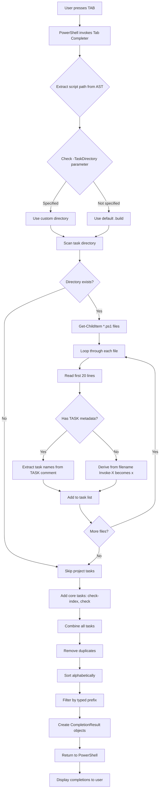

# Bolt Architecture

This document describes Bolt's internal architecture, design philosophy, and intentional limitations.

## 📖 Philosophy

### Local-First Principle (90/10 Rule)

Tasks should run **identically** locally and in CI pipelines:

- ✅ **Same commands**: `.\bolt.ps1 build` works the same everywhere
- ✅ **No special CI flags**: Avoid `if ($env:CI)` branches unless absolutely necessary
- ✅ **Consistent tooling**: Use same tool versions (e.g., Bicep CLI), same PowerShell modules
- ✅ **Deterministic behavior**: Tasks produce same results regardless of environment
- ✅ **Pipeline-agnostic**: Works with GitHub Actions, Azure DevOps, GitLab CI, etc.

### CI/CD Example

```yaml
# GitHub Actions
name: Build
on: [push]
jobs:
  build:
    runs-on: ubuntu-latest
    steps:
      - uses: actions/checkout@v4
      - name: Build Infrastructure
        run: pwsh -File bolt.ps1 build
        
# Azure DevOps
steps:
  - task: PowerShell@2
    inputs:
      filePath: 'bolt.ps1'
      arguments: 'build'
      pwsh: true
```

## 🤔 Logic Flows

### Bolt Tab Completion Flow

This diagram shows how Bolt discovers and provides tab completion for task names when you type `.\bolt.ps1 <TAB>` in the PowerShell command line.



#### Key Components

1. **Registration**  
   The tab completer is registered once when the script loads:
   ```powershell
   Register-ArgumentCompleter -CommandName 'bolt.ps1' -ParameterName 'Task' -ScriptBlock $taskCompleter
   ```

2. **Discovery Process**  
   When tab completion is triggered:

   1. **Extract Context**: Get script directory and check for `-TaskDirectory` parameter
   2. **Scan Directory**: Look for `*.ps1` files in the task directory (default: `.build/`)
   3. **Parse Metadata**: Read first 20 lines of each file looking for:
      - `# TASK: taskname` - Primary task name(s)
      - `# DESCRIPTION: description` - Task description (not used in completion)
      - `# DEPENDS: dep1, dep2` - Dependencies (not used in completion)
   4. **Filename Fallback**: If no `# TASK:` metadata, derive name from filename
      - `Invoke-TaskName.ps1` → `taskname`
      - `Invoke-My-Custom-Task.ps1` → `my-custom-task`
   5. **Combine Tasks**: Merge project tasks with core tasks (`check-index`, `check`)
   6. **Filter & Sort**: Remove duplicates, sort alphabetically, filter by typed prefix

3. **CompletionResult Format**  
   Each completion is created as:
   ```powershell
   [CompletionResult]::new($taskName, $taskName, 'ParameterValue', $taskName)
   ```

4. **Task Directory Override**  
   Users can specify custom task directories:
   ```powershell
   .\bolt.ps1 -TaskDirectory "custom-tasks" <TAB>
   ```
   The completer respects this and scans the specified directory instead of `.build/`.

#### Example Flow

**Scenario**: User types `.\bolt.ps1 b<TAB>`

1. PowerShell invokes the completer with `wordToComplete = "b"`
2. Completer scans `.build/` directory
3. Finds `Invoke-Build.ps1` with `# TASK: build`
4. Adds core tasks (`check-index`, `check`)
5. Filters for tasks starting with "b": `build`
6. Returns `[CompletionResult]` for "build"
7. PowerShell displays "build" as completion option

**Result**: User sees `.\bolt.ps1 build` and can press Enter to execute

### Bolt Task Discovery and Execution Flow

This section visualizes three core aspects of Bolt's architecture:
1. **Script Locator**: How Bolt finds task scripts in the file system
2. **Metadata Parser**: How task metadata is extracted from script files
3. **Task Dependency Resolution**: How dependencies are resolved and executed

#### 1. Script Locator and Metadata Parser

```mermaid
flowchart TD
    Start[Get-AllTasks called] --> GetCore[Get core tasks: check-index, check]
    GetCore --> CheckParam{TaskDirectory parameter?}
    
    CheckParam -->|Custom directory| ValidatePath[Validate path is relative and no ..]
    CheckParam -->|Default| UseDefault[Use .build directory]
    
    ValidatePath --> ResolvePath[Resolve full path]
    UseDefault --> ResolvePath
    
    ResolvePath --> SecurityCheck{Path within project root?}
    SecurityCheck -->|No| ThrowError[Throw security error]
    SecurityCheck -->|Yes| ScanDir[Scan directory for *.ps1 files]
    
    ScanDir --> FilterTests[Exclude *.Tests.ps1 files]
    FilterTests --> LoopFiles{For each .ps1 file}
    
    LoopFiles --> ReadFile[Read first 30 lines]
    ReadFile --> ParseMeta[Get-TaskMetadata]
    
    ParseMeta --> CheckTask{Has TASK comment?}
    
    CheckTask -->|Yes| ExtractTask[Extract from: # TASK: name1, name2]
    CheckTask -->|No| ExtractFile[Derive from filename fallback]
    
    ExtractTask --> ValidateName[Validate task name regex: ^[a-z0-9][a-z0-9\-]*$]
    ExtractFile --> ValidateName
    
    ValidateName --> ValidLength{Length <= 50?}
    ValidLength -->|No| WarnSkip[Warn and skip task]
    ValidLength -->|Yes| CheckDesc{Has DESCRIPTION comment?}
    
    CheckDesc -->|Yes| ExtractDesc[Extract from: # DESCRIPTION: text]
    CheckDesc -->|No| NoDesc[Leave description empty]
    
    ExtractDesc --> CheckDeps{Has DEPENDS comment?}
    NoDesc --> CheckDeps
    
    CheckDeps -->|Yes| ExtractDeps[Extract from: # DEPENDS: dep1, dep2]
    CheckDeps -->|No| NoDeps[Empty dependencies array]
    
    ExtractDeps --> BuildMeta[Build metadata object]
    NoDeps --> BuildMeta
    
    BuildMeta --> StoreTask[Store in tasks hashtable by name]
    StoreTask --> MoreFiles{More files?}
    
    MoreFiles -->|Yes| LoopFiles
    MoreFiles -->|No| MergeTasks[Merge core and project tasks]
    
    MergeTasks --> CheckConflict{Project task overrides core?}
    CheckConflict -->|Yes| WarnOverride[Warn about override]
    CheckConflict -->|No| Continue[Continue]
    
    WarnOverride --> ReturnAll[Return all tasks hashtable]
    Continue --> ReturnAll
    
    style Start fill:#e1f5ff
    style ReturnAll fill:#c8e6c9
    style ThrowError fill:#ffcdd2
    style SecurityCheck fill:#fff9c4
```

#### 2. Task Dependency Resolution and Execution

```mermaid
flowchart TD
    InvokeStart[Invoke-Task called] --> CheckExecuted{Task already executed?}
    
    CheckExecuted -->|Yes| SkipDup[Skip to prevent circular dependencies]
    CheckExecuted -->|No| MarkExecuted[Add to ExecutedTasks hashtable]
    
    MarkExecuted --> HasDeps{Task has dependencies?}
    
    HasDeps -->|No| ExecTask[Execute task]
    HasDeps -->|Yes| CheckOnly{-Only flag set?}
    
    CheckOnly -->|Yes| WarnSkip[Warn: Skipping dependencies]
    CheckOnly -->|No| ShowDeps[Display dependencies list]
    
    WarnSkip --> ExecTask
    ShowDeps --> LoopDeps{For each dependency}
    
    LoopDeps --> HasNamespace{Current task has namespace?}
    
    HasNamespace -->|Yes| TryNamespaced[Try {namespace}-{dependency}]
    HasNamespace -->|No| TryDirect[Try {dependency} directly]
    
    TryNamespaced --> NamespacedExists{Namespaced dep exists?}
    NamespacedExists -->|Yes| RecurseInvoke[Recursively call Invoke-Task for dependency]
    NamespacedExists -->|No| FallbackRoot[Fall back to root-level {dependency}]
    
    FallbackRoot --> RootExists{Root dep exists?}
    RootExists -->|Yes| RecurseInvoke
    RootExists -->|No| WarnMissing[Warn: Dependency not found]
    
    TryDirect --> DepExists{Dependency exists in AllTasks?}
    DepExists -->|No| WarnMissing
    DepExists -->|Yes| RecurseInvoke
    
    RecurseInvoke --> DepResult{Dependency succeeded?}
    
    DepResult -->|No| CheckErrAction{ErrorAction = Stop?}
    CheckErrAction -->|Yes| ReturnFalse[Return false, stop execution]
    CheckErrAction -->|No| WarnContinue[Warn and continue despite failure]
    
    DepResult -->|Yes| MoreDeps{More dependencies?}
    WarnMissing --> MoreDeps
    WarnContinue --> MoreDeps
    
    MoreDeps -->|Yes| LoopDeps
    MoreDeps -->|No| ExecTask
    
    ExecTask --> IsCore{Is core task?}
    
    IsCore -->|Yes| LogCore[Log core task execution]
    IsCore -->|No| LogExternal[Log external task execution]
    
    LogCore --> ExecFunc[Execute core function]
    LogExternal --> ValidateScript[Validate script path security]
    
    ValidateScript --> CheckChars{Path has dangerous chars?}
    CheckChars -->|Yes| ThrowInject[Throw: Code injection risk]
    CheckChars -->|No| CheckBounds{Path within project root?}
    
    CheckBounds -->|No| ThrowPath[Throw: Path outside project]
    CheckBounds -->|Yes| InjectUtils[Inject BoltConfig and utilities]
    
    InjectUtils --> SetContext[Set TaskScriptRoot variable]
    SetContext --> PushLoc[Push-Location to task directory]
    PushLoc --> DotSource[Dot-source task script]
    DotSource --> PopLoc[Pop-Location]
    
    ExecFunc --> CheckExit{Exit code check}
    PopLoc --> CheckExit
    
    CheckExit -->|Non-zero| LogFail[Log task failure]
    CheckExit -->|Zero or null| LogSuccess[Log task success]
    
    LogFail --> ReturnFalse
    LogSuccess --> ReturnTrue[Return true]
    
    SkipDup --> ReturnTrue
    ThrowInject --> ReturnFalse
    ThrowPath --> ReturnFalse
    
    style InvokeStart fill:#e1f5ff
    style ReturnTrue fill:#c8e6c9
    style ReturnFalse fill:#ffcdd2
    style CheckExecuted fill:#fff9c4
    style ValidateScript fill:#fff9c4
```

### Key Concepts

**Script Locator**

**Purpose**: Finds all task scripts in the specified directory.

**Process**:
1. Accepts `-TaskDirectory` parameter (default: `.build`)
2. Validates path is relative and doesn't escape project root
3. Resolves absolute path and performs security check
4. Scans for `*.ps1` files (excludes `*.Tests.ps1`)
5. Returns list of script paths for metadata parsing

**Security Features**:
- Path traversal protection (no `..` sequences)
- Absolute path validation (must be within project root)
- Relative path enforcement

#### Metadata Parser

**Purpose**: Extracts task configuration from script file comments.

**Metadata Format**:
```powershell
# TASK: build, compile          # Task names (comma-separated for aliases)
# DESCRIPTION: Compiles source  # Human-readable description
# DEPENDS: format, lint          # Dependencies (comma-separated)
```

**Parsing Logic**:
1. Read first 30 lines of script file
2. Use regex to match comment patterns:
   - `(?m)^#\s*TASK:\s*(.+)$` - Extract task names
   - `(?m)^#\s*DESCRIPTION:[ \t]*([^\r\n]*)` - Extract description
   - `(?m)^#\s*DEPENDS:(.*)$` - Extract dependencies
3. Validate task names (lowercase, alphanumeric, hyphens only, max 50 chars)
4. Fallback: If no `# TASK:` found, derive from filename
   - `Invoke-Build.ps1` → `build`
   - `Invoke-My-Task.ps1` → `my-task`

**Metadata Object**:
```powershell
@{
    Names = @('build', 'compile')  # Array of task names (first is primary)
    Description = 'Compiles source'
    Dependencies = @('format', 'lint')
    ScriptPath = 'C:\project\.build\Invoke-Build.ps1'
    IsCore = $false
    UsedFilenameFallback = $false
}
```

##### Task Dependency Resolution

**Purpose**: Execute tasks in correct order respecting dependencies.

**Algorithm**:
1. **Duplicate Prevention**: Check `ExecutedTasks` hashtable
   - If task already executed, return immediately (prevents circular deps)
   - Otherwise, mark as executed BEFORE processing dependencies
2. **Dependency Processing**:
   - If `-Only` flag: Skip dependencies with warning
   - Otherwise: Recursively invoke each dependency task
3. **Execution**:
   - **Core tasks**: Call PowerShell function directly
   - **External tasks**: 
     - Validate script path (security checks)
     - Inject `$BoltConfig` object and utility functions
     - Set `$TaskScriptRoot` context variable
     - Push-Location to task directory
     - Dot-source task script
     - Pop-Location to restore directory
4. **Result Handling**:
   - Check `$LASTEXITCODE` for success/failure
   - Log security events (execution start/completion)
   - Return boolean result up the call stack

**Circular Dependency Protection**:
```
Task A depends on B
Task B depends on C  
Task C depends on A  # CIRCULAR!

Execution:
1. Invoke A → Mark A executed
2. Check deps: B → Invoke B → Mark B executed
3. Check deps: C → Invoke C → Mark C executed
4. Check deps: A → Already executed! Skip (prevents infinite loop)
```

**Example Execution Tree**:
```
bolt build
├── format (dependency)
│   └── (no dependencies)
├── lint (dependency)
│   └── (no dependencies)
└── build (main task)
```

Execution order: `format` → `lint` → `build`

#### Configuration Injection

When external tasks execute, Bolt injects:

1. **`$BoltConfig` object**: Project configuration from `bolt.config.json`
2. **Utility functions**: Helper functions like `Get-TaskConfig`, `Get-ProjectRoot`
3. **Context variables**: `$TaskScriptRoot` pointing to task's directory

This allows tasks to access project settings and utilities without importing modules.

#### Example Task File

```powershell
# .build/Invoke-Build.ps1
# TASK: build, compile
# DESCRIPTION: Compiles all Bicep files to ARM templates
# DEPENDS: format, lint

Write-Host "Building..." -ForegroundColor Cyan

# Access injected configuration
$outputDir = $BoltConfig.build.outputDirectory

# Task logic here
bicep build main.bicep --outdir $outputDir

if ($LASTEXITCODE -ne 0) {
    Write-Host "✗ Build failed" -ForegroundColor Red
    exit 1
}

Write-Host "✓ Build succeeded" -ForegroundColor Green
exit 0
```

## 🎯 Design Philosophy

Bolt makes deliberate architectural choices that prioritize reliability, reproducibility, and immediate action over complexity.

### ⚡ Zero Analysis - Immediate Execution

**Bolt starts working while other tools are still figuring out what to skip.**

**Why No Automatic Caching**: 
- No upfront analysis overhead - tasks run immediately
- No complex dependency tracking that can break
- No stale cache invalidation bugs that silently break builds
- **You control when tasks run** - explicit `-Only` flag for fast iteration

**The Bolt Advantage**: When you need speed, you get it instantly with `-Only`. When you need correctness, every task runs fresh. No hidden state, no cache invalidation bugs, no surprises.

```powershell
# Fast iteration during development - skip deps explicitly
.\bolt.ps1 build -Only

# Full validation when it matters - every time, guaranteed
.\bolt.ps1 build
```

### 🔒 Guaranteed Execution Order

**Feature, not limitation**: Bolt ensures 100% reproducible builds with predictable task execution.

**Why Sequential Execution is a Strength**:
- **Zero race conditions** - tasks never conflict over shared files
- **Deterministic CI/CD** - builds succeed or fail for the same reason every time
- **Debuggable failures** - clean output, clear execution order, no interleaved logs
- **Predictable dependencies** - format → lint → build runs identically everywhere

**Real-World Impact**:
```powershell
# Both tasks modify the same files - parallel execution would race
.\bolt.ps1 format lint  # Sequential: format completes, then lint reads formatted files ✓

# If parallel: format and lint both modify files simultaneously ✗
# Result: non-deterministic failures, impossible to debug
```

**Power User Escape Hatch**: Need raw speed for processing many files? Implement parallelism **inside** your task using PowerShell's native capabilities:

```powershell
# Inside a task: parallel file processing
$files | ForEach-Object -Parallel {
    bicep build $_.FullName
} -ThrottleLimit 10

# Orchestrator stays sequential (safe), file processing runs parallel (fast)
```

**Design Decision**: Bolt chooses reliability over speed at the orchestration level. This eliminates entire classes of race conditions and non-deterministic failures that plague parallel build systems. For processing many files within a single task, PowerShell's `ForEach-Object -Parallel` gives you speed without sacrificing build reproducibility.

### ❌ Task Argument Passing via Bolt CLI

**Not Implemented**: Passing named arguments to task scripts through the bolt command (e.g., `.\bolt.ps1 deploy -Environment prod`).

**Rationale**:
- When bolt runs multiple tasks (`format lint deploy`), it's unclear which task gets which arguments
- Task arguments would conflict with bolt's own parameters (`-Task`, `-Only`, `-Outline`)
- Task scripts can use `param()` blocks, but parameters only work when calling directly (bypassing dependency resolution): `.\Invoke-Deploy.ps1 -Environment prod`

**What to Use Instead**:

1. **`bolt.config.json` (Recommended)** - Type-safe configuration:
   ```json
   {
     "Azure": {
       "Environment": "prod",
       "Region": "eastus"
     }
   }
   ```
   Tasks automatically receive `$BoltConfig` variable.

2. **Environment Variables** - For dynamic values:
   ```powershell
   $env:DEPLOY_ENV = "prod"
   .\bolt.ps1 deploy
   ```

3. **Configuration Files** - Load JSON/YAML/XML in your task scripts as needed.

**Design Decision**: Configuration should be declarative (config files) not imperative (command-line arguments). Type safety and validation through `bolt.config.json` provide more value than CLI convenience.

---

[← Back to README](../README.md)
