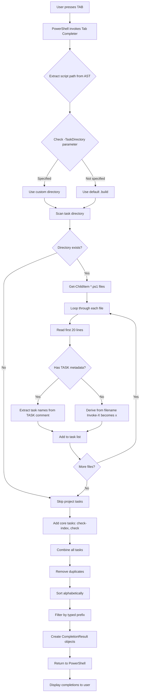

# Bolt Tab Completion Flow

This diagram shows how Bolt discovers and provides tab completion for task names when you type `.\bolt.ps1 <TAB>` in the PowerShell command line.



## Key Components

### 1. Registration
The tab completer is registered once when the script loads:
```powershell
Register-ArgumentCompleter -CommandName 'bolt.ps1' -ParameterName 'Task' -ScriptBlock $taskCompleter
```

### 2. Discovery Process
When tab completion is triggered:

1. **Extract Context**: Get script directory and check for `-TaskDirectory` parameter
2. **Scan Directory**: Look for `*.ps1` files in the task directory (default: `.build/`)
3. **Parse Metadata**: Read first 20 lines of each file looking for:
   - `# TASK: taskname` - Primary task name(s)
   - `# DESCRIPTION: description` - Task description (not used in completion)
   - `# DEPENDS: dep1, dep2` - Dependencies (not used in completion)
4. **Filename Fallback**: If no `# TASK:` metadata, derive name from filename
   - `Invoke-TaskName.ps1` → `taskname`
   - `Invoke-My-Custom-Task.ps1` → `my-custom-task`
5. **Combine Tasks**: Merge project tasks with core tasks (`check-index`, `check`)
6. **Filter & Sort**: Remove duplicates, sort alphabetically, filter by typed prefix

### 3. CompletionResult Format
Each completion is created as:
```powershell
[CompletionResult]::new($taskName, $taskName, 'ParameterValue', $taskName)
```

### 4. Task Directory Override
Users can specify custom task directories:
```powershell
.\bolt.ps1 -TaskDirectory "custom-tasks" <TAB>
```
The completer respects this and scans the specified directory instead of `.build/`.

## Example Flow

**Scenario**: User types `.\bolt.ps1 b<TAB>`

1. PowerShell invokes the completer with `wordToComplete = "b"`
2. Completer scans `.build/` directory
3. Finds `Invoke-Build.ps1` with `# TASK: build`
4. Adds core tasks (`check-index`, `check`)
5. Filters for tasks starting with "b": `build`
6. Returns `[CompletionResult]` for "build"
7. PowerShell displays "build" as completion option

**Result**: User sees `.\bolt.ps1 build` and can press Enter to execute
