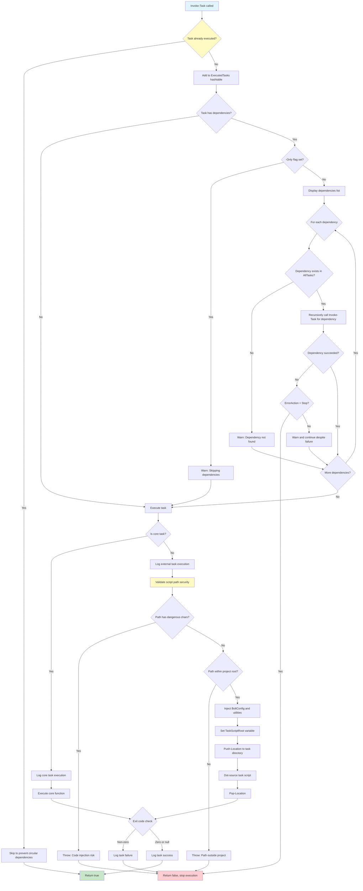

# Bolt Task Discovery and Execution Flow

This document visualizes three core aspects of Bolt's architecture:
1. **Script Locator**: How Bolt finds task scripts in the file system
2. **Metadata Parser**: How task metadata is extracted from script files
3. **Task Dependency Resolution**: How dependencies are resolved and executed

## 1. Script Locator and Metadata Parser

```mermaid
flowchart TD
    Start[Get-AllTasks called] --> GetCore[Get core tasks: check-index, check]
    GetCore --> CheckParam{TaskDirectory parameter?}
    
    CheckParam -->|Custom directory| ValidatePath[Validate path is relative and no ..]
    CheckParam -->|Default| UseDefault[Use .build directory]
    
    ValidatePath --> ResolvePath[Resolve full path]
    UseDefault --> ResolvePath
    
    ResolvePath --> SecurityCheck{Path within project root?}
    SecurityCheck -->|No| ThrowError[Throw security error]
    SecurityCheck -->|Yes| ScanDir[Scan directory for *.ps1 files]
    
    ScanDir --> FilterTests[Exclude *.Tests.ps1 files]
    FilterTests --> LoopFiles{For each .ps1 file}
    
    LoopFiles --> ReadFile[Read first 30 lines]
    ReadFile --> ParseMeta[Get-TaskMetadata]
    
    ParseMeta --> CheckTask{Has TASK comment?}
    
    CheckTask -->|Yes| ExtractTask[Extract from: # TASK: name1, name2]
    CheckTask -->|No| ExtractFile[Derive from filename fallback]
    
    ExtractTask --> ValidateName[Validate task name regex: ^a-z0-9a-z0-9-*$]
    ExtractFile --> ValidateName
    
    ValidateName --> ValidLength{Length <= 50?}
    ValidLength -->|No| WarnSkip[Warn and skip task]
    ValidLength -->|Yes| CheckDesc{Has DESCRIPTION comment?}
    
    CheckDesc -->|Yes| ExtractDesc[Extract from: # DESCRIPTION: text]
    CheckDesc -->|No| NoDesc[Leave description empty]
    
    ExtractDesc --> CheckDeps{Has DEPENDS comment?}
    NoDesc --> CheckDeps
    
    CheckDeps -->|Yes| ExtractDeps[Extract from: # DEPENDS: dep1, dep2]
    CheckDeps -->|No| NoDeps[Empty dependencies array]
    
    ExtractDeps --> BuildMeta[Build metadata object]
    NoDeps --> BuildMeta
    
    BuildMeta --> StoreTask[Store in tasks hashtable by name]
    StoreTask --> MoreFiles{More files?}
    
    MoreFiles -->|Yes| LoopFiles
    MoreFiles -->|No| MergeTasks[Merge core and project tasks]
    
    MergeTasks --> CheckConflict{Project task overrides core?}
    CheckConflict -->|Yes| WarnOverride[Warn about override]
    CheckConflict -->|No| Continue[Continue]
    
    WarnOverride --> ReturnAll[Return all tasks hashtable]
    Continue --> ReturnAll
    
    style Start fill:#e1f5ff
    style ReturnAll fill:#c8e6c9
    style ThrowError fill:#ffcdd2
    style SecurityCheck fill:#fff9c4
```



## 2. Task Dependency Resolution and Execution



## Key Concepts

### Script Locator

**Purpose**: Finds all task scripts in the specified directory.

**Process**:
1. Accepts `-TaskDirectory` parameter (default: `.build`)
2. Validates path is relative and doesn't escape project root
3. Resolves absolute path and performs security check
4. Scans for `*.ps1` files (excludes `*.Tests.ps1`)
5. Returns list of script paths for metadata parsing

**Security Features**:
- Path traversal protection (no `..` sequences)
- Absolute path validation (must be within project root)
- Relative path enforcement

### Metadata Parser

**Purpose**: Extracts task configuration from script file comments.

**Metadata Format**:
```powershell
# TASK: build, compile          # Task names (comma-separated for aliases)
# DESCRIPTION: Compiles source  # Human-readable description
# DEPENDS: format, lint          # Dependencies (comma-separated)
```

**Parsing Logic**:
1. Read first 30 lines of script file
2. Use regex to match comment patterns:
   - `(?m)^#\s*TASK:\s*(.+)$` - Extract task names
   - `(?m)^#\s*DESCRIPTION:[ \t]*([^\r\n]*)` - Extract description
   - `(?m)^#\s*DEPENDS:(.*)$` - Extract dependencies
3. Validate task names (lowercase, alphanumeric, hyphens only, max 50 chars)
4. Fallback: If no `# TASK:` found, derive from filename
   - `Invoke-Build.ps1` → `build`
   - `Invoke-My-Task.ps1` → `my-task`

**Metadata Object**:
```powershell
@{
    Names = @('build', 'compile')  # Array of task names (first is primary)
    Description = 'Compiles source'
    Dependencies = @('format', 'lint')
    ScriptPath = 'C:\project\.build\Invoke-Build.ps1'
    IsCore = $false
    UsedFilenameFallback = $false
}
```

### Task Dependency Resolution

**Purpose**: Execute tasks in correct order respecting dependencies.

**Algorithm**:
1. **Duplicate Prevention**: Check `ExecutedTasks` hashtable
   - If task already executed, return immediately (prevents circular deps)
   - Otherwise, mark as executed BEFORE processing dependencies
2. **Dependency Processing**:
   - If `-Only` flag: Skip dependencies with warning
   - Otherwise: Recursively invoke each dependency task
3. **Execution**:
   - **Core tasks**: Call PowerShell function directly
   - **External tasks**: 
     - Validate script path (security checks)
     - Inject `$BoltConfig` object and utility functions
     - Set `$TaskScriptRoot` context variable
     - Push-Location to task directory
     - Dot-source task script
     - Pop-Location to restore directory
4. **Result Handling**:
   - Check `$LASTEXITCODE` for success/failure
   - Log security events (execution start/completion)
   - Return boolean result up the call stack

**Circular Dependency Protection**:
```
Task A depends on B
Task B depends on C  
Task C depends on A  # CIRCULAR!

Execution:
1. Invoke A → Mark A executed
2. Check deps: B → Invoke B → Mark B executed
3. Check deps: C → Invoke C → Mark C executed
4. Check deps: A → Already executed! Skip (prevents infinite loop)
```

**Example Execution Tree**:
```
bolt build
├── format (dependency)
│   └── (no dependencies)
├── lint (dependency)
│   └── (no dependencies)
└── build (main task)
```

Execution order: `format` → `lint` → `build`

## Configuration Injection

When external tasks execute, Bolt injects:

1. **`$BoltConfig` object**: Project configuration from `bolt.config.json`
2. **Utility functions**: Helper functions like `Get-TaskConfig`, `Get-ProjectRoot`
3. **Context variables**: `$TaskScriptRoot` pointing to task's directory

This allows tasks to access project settings and utilities without importing modules.

## Example Task File

```powershell
# .build/Invoke-Build.ps1
# TASK: build, compile
# DESCRIPTION: Compiles all Bicep files to ARM templates
# DEPENDS: format, lint

Write-Host "Building..." -ForegroundColor Cyan

# Access injected configuration
$outputDir = $BoltConfig.build.outputDirectory

# Task logic here
bicep build main.bicep --outdir $outputDir

if ($LASTEXITCODE -ne 0) {
    Write-Host "✗ Build failed" -ForegroundColor Red
    exit 1
}

Write-Host "✓ Build succeeded" -ForegroundColor Green
exit 0
```
